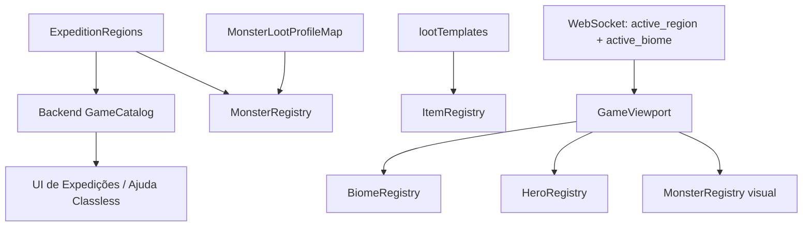

# Project Atlas — Arquitetura Modular de Conteúdo

## Objetivo

Esta refatoração separa **conteúdo do jogo** de **regras do motor**. Expedições,
monstros, itens, biomas, heróis e starter packs passam a ser resolvidos por
catálogos/registries. O loop de combate e o viewport não precisam conhecer cada
conteúdo existente.

Premissas preservadas:

- protocolo e fluxo WebSocket existentes continuam sendo a base do realtime;
- IDs e `visual_key` atuais foram mantidos;
- nomes continuam sendo aceitos onde há necessidade de compatibilidade, mas não
  são mais o identificador primário;
- balanceamento atual (stats, raridades, tiers e tabelas de loot) não foi
  redesenhado por esta mudança arquitetural.

## Arquitetura resultante

O backend continua autoritativo para progressão e conteúdo. O frontend recebe
metadados de expedição através de `GET /api/v1/game/catalog`, em vez de manter
uma segunda `WORLD_REGIONS` que poderia divergir.

## Fontes de verdade

| Domínio | Fonte canônica | Consumidores |
|---|---|---|
| Expedições e fases | `backend/pkg/game/expeditions.go` | engine, offline, GameCatalog |
| Loot por monstro | `MonsterLootProfileMap` em `loot.go` | `MonsterRegistry`, gerador de loot |
| Itens/equipamentos | `lootTemplates` + `ItemRegistry` | loot, starters, equipamento |
| Estilos classless | `backend/pkg/game/starter_packs.go` | ajuda de estilos via GameCatalog; handler legado compatível |
| Biomas visuais | `BiomeRegistry.ts` + `BiomeRenderers.ts` | `GameViewport` |
| Heróis visuais | `HeroRegistry.ts` + `HeroRenderers.ts` | `GameViewport` |
| Monstros visuais | `MonsterRegistry.ts` + `renderers/monsters/tier*.ts` | `PixelArtRenderer`, `GameViewport` |

## Mudanças cirúrgicas implementadas

### Frontend

- `PixelArtRenderer.ts` deixou de ser um god object. De aproximadamente 3 mil
  linhas no snapshot recebido, passou a uma fachada pequena para textura de
  monstro.
- Cenários foram movidos para `renderers/biomes/BiomeRenderers.ts`.
- Heróis foram movidos para `renderers/heroes/HeroRenderers.ts`.
- As 35 famílias visuais de monstros foram separadas por tier em
  `renderers/monsters/tier1.ts` ... `tier5.ts` e registradas em
  `MonsterRegistry`.
- `GameViewport` não contém mais a cadeia região -> background nem a cadeia
  nome do monstro -> região. Ele consulta registries.
- A animação de ataque do herói é declarada em `HeroRegistry` por
  `attackStyle`, sem inferir vocação com `includes()`.
- Projéteis especiais de monstros são metadados do `MonsterRegistry`, sem
  inferência por nome (`dragão`, `chamas` etc.).
- `WORLD_REGIONS` foi removido. As abas de tier, limites de nível, boss,
  `maxStages` e previews vêm do backend.
- A antiga escolha de kit foi removida. `CombatStylesHelpModal` renderiza os
  metadados de `starter_packs` apenas como ajuda; toda troca real de estilo
  acontece ao equipar armas.
- URLs HTTP/WS foram centralizadas em `config.ts` e aceitam
  `VITE_API_BASE_URL` / `VITE_WS_BASE_URL`.
- `SpriteGenerator.ts`, que não possuía consumidores e mantinha regras visuais
  antigas duplicadas, foi removido.

### Backend

- `MonsterRegistry` fornece lookup canônico por `Key` e alias exato de nome;
  foi removido o grande fallback `strings.Contains` de loot.
- `ItemRegistry` indexa `lootTemplates`, evitando lookup linear e fazendo o
  template ser a fonte canônica para metadados legados.
- Skill books possuem `SkillKey` no template e no item gerado. Ensinar uma
  skill não depende mais de palavras como "fogo", "cura" ou "livro" no nome.
- Starter packs são conteúdo declarativo (`starter_packs.go`); o engine apenas
  aplica `MainHand`, `OffHand`, `Ammo` e `Backpack` declarados.
- `MaxStages = 5` deixou de ser regra espalhada pelo engine. Spawn do boss,
  offline e UI usam `ExpeditionRegion.MaxStages`.
- `BiomeKey` foi separado de `Region.ID` e é enviado como `active_biome` nas
  mensagens de combate.
- `GameCatalog` expõe somente metadados públicos necessários à UI, sem vazar
  stats internos dos monstros.

## Como adicionar conteúdo sem alterar o motor

### Nova expedição

1. Adicione uma entrada declarativa em `ExpeditionRegions` com `ID`,
   `BiomeKey`, tier, níveis, `MaxStages`, unlock, drops, monstros e boss.
2. Se reutilizar um bioma existente, nenhuma regra do `GameViewport` muda.
3. Se for um bioma visual novo, crie o renderer e registre uma entrada em
   `BiomeRegistry`.

O modal de mapa, a lista de tiers e o contador de fases passam a exibir a nova
expedição pelo `GameCatalog` automaticamente.

### Novo monstro

1. Dê ao monstro uma `Key` estável e `VisualKey`; nunca use `Name` como ID.
2. Cadastre o `MonsterLootProfile` pela mesma key.
3. Adicione seu renderer no módulo de monstros apropriado e registre seus
   metadados visuais (`biomeKey`, projétil se necessário).

Não é necessário modificar `GameViewport`, `PixelArtRenderer` ou o loop de
loot.

### Novo equipamento

1. Adicione um `LootTemplate` com `Tier`, `Slot`, `WeaponType` e stats.
2. Referencie o nome canônico nos perfis de loot desejados.

O `ItemRegistry` indexa o novo template automaticamente. Itens novos devem
sempre persistir `slot_type` e `weapon_type`; inferência por nome não faz parte
do caminho canônico.

### Nova skill book

Adicione `LootTemplate` com `SlotSkillBook` e `SkillKey`. O aprendizado do livro
é completamente independente do texto exibido no `Name`.

> O **efeito de combate de uma skill nova** ainda é uma regra do motor e hoje
> fica no switch de execução de skills em `engine.go`. Transformar handlers de
> skills em um `SkillRegistry` executável é o próximo refactor de domínio mais
> valioso, mas foi deixado fora deste corte para não misturar mudança de regra
> de combate com migração de conteúdo.

### Novo herói / vocação visual

Crie seu renderer em `HeroRenderers` (ou em um módulo dedicado) e registre a
vocação/aliases e `attackStyle` em `HeroRegistry`. O viewport permanece
inalterado.

### Novo estilo de combate documentado

Adicione uma entrada em `StarterPacks`. A ajuda recebe automaticamente o novo
estilo pelo GameCatalog. Isso não cria uma classe nem concede outro kit. Se o
estilo introduzir uma aparência inédita, registre também o visual no
`HeroRegistry`.

## O que permaneceu como switch de propósito

Nem todo `switch` é dívida arquitetural. Foram mantidos os que representam um
conjunto pequeno de **regras do motor**, por exemplo:

- estados de AI/combat (`CHASE`, `ATTACK`, `FLEE`);
- postura tática;
- regras diferentes para categorias de arma;
- atribuição de slots estruturais do inventário;
- apresentação de raridade.

Esses switches mudam quando a regra do jogo muda, não quando apenas um novo
monstro/expedição/item é cadastrado.

## Guard rails de regressão

Os testes de `loot_test.go` agora verificam adicionalmente:

- todo monstro de expedição possui perfil de loot canônico;
- um monstro não referencia item de tier superior ao da região;
- item dropado não exige nível acima do `MaxLevel` da região;
- todo item anunciado em `DropsPreview` é realmente obtível de algum monstro
  ou boss daquela região;
- starter packs só referenciam templates existentes.

`expeditions_test.go` continua verificando que monstros e bosses ficam dentro
da faixa de nível da região, inclusive os casos de regressão de Esgotos e
Floresta.

## Validação desta entrega

- Frontend: `npm run build` passou após cada corte estrutural (`tsc` + Vite).
- Auditoria independente: `node tools/audit-content.mjs` passou com **8 regiões,
  35 monstros/bosses, 35 perfis de loot, 73 templates de item e 35 visual_keys,
  sem inconsistências** de nível, tier, preview ou renderer.
- Backend: os testes Go foram preparados/expandidos, mas não puderam ser
  executados neste ambiente porque o runtime `go`/`gofmt` não está instalado.
  Antes de mergear, execute `gofmt -w backend && cd backend && go test ./...`.

## Próximos cortes recomendados

1. Extrair handlers de skills do `engine.go` para um `SkillRegistry`.
2. Separar o `engine.go` por responsabilidades (`combat`, `inventory`,
   `progression`, `session`) mantendo `GameSession` como fachada.
3. Tornar animações de bioma uma camada dinâmica independente do background
   cacheado (nuvens, fogueira, partículas no acampamento).
4. Levar a configuração de raridades e curvas de balanceamento para um catálogo
   versionado, quando houver necessidade real de live balance.

O princípio para as próximas features é simples: **conteúdo registra dados e
renderers; o motor trabalha apenas com contratos e keys estáveis**.

## Módulos de UI: Inventário & Equipamentos

- `ItemIcon.tsx`: Fachada para ícones vetoriais SVG de 15 slots/armas, helpers universais de raridade (`getRarityStyle`), rótulos canônicos de slots (`getSlotLabel`), badges de atributos (`BonusBadges`) e normalização de nomes (`getCleanItemName`).
- `TibiaEquipmentGrid.tsx`: Grid 3x4 estilo Tibia, barras clássicas de HP/Mana com gradientes, cálculo de capacidade em tempo real e Super Tooltip com bônus de atributos e requisitos de nível sincronizados.
- `TibiaBackpackModal.tsx`: Modal responsivo de inventário com barra de filtros (tipos de equipamento e raridades), busca instantânea, cálculo de bônus globais e fluxo de venda de itens em lote.
