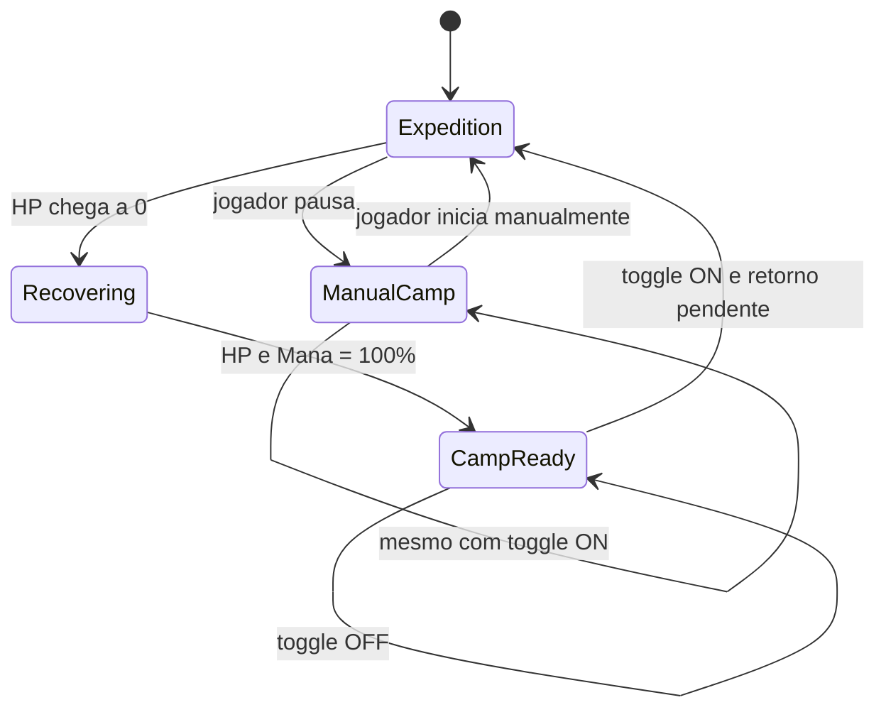

# Project Atlas — Plano de Refatoramento Cirúrgico

## Objetivo

Corrigir de forma coesa cinco áreas do jogo sem reescrever sistemas que já funcionam:

1. níveis, progressão e spawn de monstros por expedição;
2. consistência das tabelas de loot e dos previews;
3. identidade visual única para todos os 35 monstros/bosses atuais;
4. acampamento vivo e visualmente reconhecível;
5. retorno automático à expedição depois da recuperação completa, somente enquanto o jogo está online.

Este plano foi produzido a partir do snapshot Repomix enviado, contendo 50 arquivos do projeto.

---

## Decisão técnica

### Não aplicar o refactor diretamente no XML Repomix

O snapshot contém código suficiente para diagnosticar e especificar as alterações, mas não é o repositório Git de trabalho. Editar/reconstruir os 50 arquivos a partir do XML criaria uma cópia paralela sem garantir que ela corresponde exatamente ao checkout atual usado no Antigravity.

Portanto, a execução recomendada é aplicar este plano no repositório real pelo Antigravity, em etapas pequenas e testáveis.

Se o repositório real (pasta/ZIP ou Git) for disponibilizado posteriormente, o mesmo refactor pode ser feito diretamente e validado aqui.

---

# 1. Diagnóstico confirmado — níveis dos monstros

## Causa raiz 1: frontend e backend possuem faixas diferentes

O frontend (`ExpeditionSelectionModal.tsx`) anuncia:

| Tier | Faixa exibida |
|---|---:|
| 1 | 1–5 |
| 2 | 5–12 |
| 3 | 12–20 |
| 4 | 20–35 |
| 5 | 35–99 |

Já `backend/pkg/game/expeditions.go` usa:

| Tier | Faixa no backend atual |
|---|---:|
| 1 | 1–7 |
| 2 | 8–19 |
| 3 | 20–34 |
| 4 | 35–49 |
| 5 | 50–99 |

Isso explica por que a interface diz uma coisa e o combate entrega outra.

## Causa raiz 2: o nível do template do monstro é ignorado

`GetRandomMonsterForRegion(regionID, playerLevel, r)` escolhe o nome/template do monstro, porém começa o nível assim:

```go
mobLevel := playerLevel
```

Depois limita esse valor pela faixa do **backend**, não pela faixa mostrada no frontend, e ainda aplica `±1`.

Consequências reais:

- jogador Lv.31 em Esgotos → clamp em 19 → monstros Lv.18/19;
- jogador Lv.8 na Floresta → clamp em 7 → monstros Lv.6/7;
- o `Level` declarado em `Goblin Salteador: 1`, `Lobo: 3`, etc. não é o nível efetivamente usado para mobs comuns;
- o boss segue outro caminho e usa o nível fixo cadastrado, gerando mais uma regra diferente.

O mesmo comportamento é reutilizado pela simulação offline através de `buildOfflineWave`, então a correção precisa valer para online e offline.

## Regra nova recomendada

1. A faixa exibida ao jogador é o contrato do jogo: `1–5`, `5–12`, `12–20`, `20–35`, `35–99`.
2. O nível do jogador não altera o nível do monstro de uma região antiga.
3. Cada espécie possui nível-base fixo dentro da faixa da região.
4. O boss é sempre o inimigo mais forte ou um dos mais fortes da região.
5. Level do monstro, HP e ataque devem vir de uma única definição de balanceamento; não reescalar silenciosamente um template já balanceado com `playerLevel`.

### Níveis propostos

| Região | Monstro | Nível |
|---|---|---:|
| Floresta dos Aprendizes | Goblin Salteador | 1 |
| | Lobo Selvagem | 3 |
| | Aranha de Espinhos | 4 |
| | **Boss: Urso Ranzinza dos Carinhosos** | **5** |
| Vila do Shereque | Ogre Verde | 2 |
| | Burro Falante | 4 |
| | **Boss: Fiona Arrazadora** | **5** |
| Vila do Chapolin | Pirata Alma Negra | 3 |
| | Tripa Seca | 4 |
| | Bandido dos Ermos | 4 |
| | **Boss: Alma Negra de Greiscu** | **5** |
| Castelo de Greiscu | Orc Guerreiro | 6 |
| | Orc Mago | 7 |
| | Esqueleto Guardião | 8 |
| | Orc Arqueiro | 9 |
| | Orc Berserker | 10 |
| | **Boss: Esquelético Pacato** | **12** |
| Esgotos Tartaruga | Ninja do Clã do Pé | 7 |
| | Rato Mutante | 10 |
| | **Boss: Destruidor Ranzinza** | **12** |
| Escola de Rogartes | Dementador das Sombras | 13 |
| | Trasgo das Cavernas | 17 |
| | **Boss: Voldemorte sem Nariz** | **20** |
| Santuário de Atenas | Lorde Espectro | 22 |
| | Zumbi Congelado | 25 |
| | Golem de Gelo | 28 |
| | Quimera do Frost | 33 |
| | **Boss: Mestre do Santuário** | **35** |
| Caverna do Dragão Perdido | Dragão Cinderino | 40 |
| | Demônio Ancestral | 50 |
| | Vampiro Ancestral | 60 |
| | Necromante Sombrio | 65 |
| | Escorpião Infernal | 70 |
| | Lorde das Chamas | 78 |
| | **Boss: Vingador de Chifres** | **85** |

Os valores preservam o perfil relativo já existente, mas ficam dentro da faixa que a UI promete.

## Implementação

Em `backend/pkg/game/expeditions.go`:

- alinhar `MinLevel`/`MaxLevel` às faixas exibidas acima;
- atualizar os níveis dos templates conforme a tabela;
- remover `playerLevel` da decisão do nível do monstro;
- preferencialmente mudar para `GetRandomMonsterForRegion(regionID string, r *rand.Rand)`;
- clonar o template selecionado e manter `Level` do template;
- se for desejada pequena variação de HP/ataque, usar percentual pequeno sobre o valor do template, sem mudar o `Level`;
- manter boss a partir do mesmo modelo de dados dos monstros normais.

Em `backend/pkg/game/offline.go` e `backend/pkg/game/engine.go`:

- atualizar chamadas para o novo gerador;
- garantir que online e offline usem exatamente os mesmos templates e níveis.

### Testes obrigatórios

Criar `backend/pkg/game/expeditions_test.go` com testes table-driven:

- todo template normal e boss deve satisfazer `MinLevel <= Level <= MaxLevel`;
- para personagens Lv.1, 5, 8, 31, 60 e 100, nenhum spawn pode fugir da faixa da região;
- o nível retornado para uma espécie não muda em função do nível do personagem;
- boss também respeita a faixa;
- `buildOfflineWave` obedece à mesma regra.

Casos de regressão explícitos:

```text
Lv.31 + Esgotos Tartaruga -> Ninja Lv.7 / Rato Lv.10 / Boss Lv.12
Lv.8  + Floresta          -> Goblin Lv.1 / Lobo Lv.3 / Aranha Lv.4 / Boss Lv.5
```

---

# 2. Auditoria do loot

## Problemas estruturais encontrados

### 2.1 Há múltiplas fontes de verdade

Hoje coexistem:

- `lootTemplates` em `backend/pkg/game/loot.go`;
- `lootTableForMonster` no mesmo arquivo;
- `DropsPreview` em `backend/pkg/game/expeditions.go`;
- `WORLD_REGIONS[].dropsPreview` em `frontend/.../ExpeditionSelectionModal.tsx`;
- `db.GetRandomLoot`, com thresholds antigos de apenas 3 tiers (`1/15/40`), injetado em `GameSession` por `GetLootFunc`, embora o combate atual use `GenerateLootForMonster` diretamente;
- `base_monsters`/cache de monstros no DB, também divergente das definições atuais de `ExpeditionRegions`.

Isso torna muito fácil corrigir um arquivo e deixar outro desatualizado.

### 2.2 Previews que não correspondem aos drops reais

| Região | Situação encontrada |
|---|---|
| Floresta | drops reais são Tier 1; preview é apenas parcial. O texto `Loot Exclusivo` é enganoso, pois vários itens também aparecem em outras regiões. |
| Shereque | preview anuncia `Sandálias Ágeis`, mas Ogre/Burro/Fiona não dropam esse item pela tabela atual. |
| Chapolin | frontend anuncia `Sabre de Bronze` e `Coifa de Prata`, mas a tabela atual dropa itens Tier 1 como Espada/Machadinha/Broquel/Anel/Flechas. |
| Castelo de Greiscu | preview anuncia `Mochila de Aventureiro`, que não aparece em nenhuma tabela dos monstros da região. No frontend também aparece `Espada de Aço`, de outro tier. |
| Esgotos | preview anuncia `Calça de Couro`, mas a tabela atual não a entrega; por outro lado Ninja/Rato podem entregar Sabre, Coifa e Flechas de Aço não mostrados. `Virotes Perfurantes` requer Lv.20, acima do máximo Lv.12 anunciado para a região. |
| Rogartes | frontend anuncia itens incompatíveis com a tabela real (`Cajado Rúnico`, `Varinha das Relíquias`, `Robe Místico`). Backend e frontend estão fortemente divergentes. |
| Santuário | frontend anuncia `Escudo do Zodíaco` e `Armadura de Ouro` (Tier 5), que não fazem parte do loot real da região. |
| Abismo | é a região mais coerente; preview é parcial, mas os drops efetivos pertencem ao conjunto esperado de Tier 5. |

### 2.3 Boss stage dá 100% de drop também aos guarda-costas

No online:

```go
if s.IsBossStage {
    dropChance = 1.00
}
```

Esse teste é executado para **cada monstro morto na onda**, incluindo os dois mobs comuns que acompanham o boss.

No offline existe a mesma lógica com `if bossStage { dropChance = 1.0 }`.

Resultado: uma fase de boss pode gerar três rolls garantidos, e não apenas o drop garantido do chefe.

Correção:

```text
isBossKill = monster.IsBoss (preferível) ou monster.ID/nome canônico do boss
dropChance = 1.0 somente quando isBossKill
dropChance = 0.35 para os guarda-costas
```

### 2.4 Boss garantido não significa raridade garantida

`rollRarity(maxRarity, r)` usa `maxRarity` apenas como teto. Um boss com teto `Raro` ainda pode gerar item `Comum` ou `Incomum`.

Isso conflita com a especificação do projeto, que descreve recompensa de boss rara/lendária.

Recomendação:

- drop de item do boss: 100%;
- raridade mínima de boss: `Raro`;
- teto por tier/região continua configurável (`Raro`, `Épico`, `Lendário`);
- guarda-costas continuam com regra normal.

## Refactor recomendado do loot

### A. Manter uma tabela canônica por monstro

Substituir o grande `switch strings.Contains(...)` por tabela explícita com ID estável:

```go
type MonsterLootProfile struct {
    Items     []string
    DropChance float64
    MinRarity string
    MaxRarity string
}
```

Cada monstro deve possuir um `Key` estável (ex.: `forest_goblin`, `esgotos_rat`, `esgotos_boss_destroyer`). Nome de exibição não deve ser chave de regra de negócio.

### B. Tier explícito no item

Adicionar `Tier int` ao `LootTemplate` em vez de inferir tier por `RequiredLevel`. O tier é pertencimento ao catálogo; `RequiredLevel` é apenas requisito para equipar.

Isso evita que ajustar requisito de nível mova silenciosamente o item de tier.

### C. Preview derivado da fonte real

Não manter uma lista independente em React.

O backend deve expor metadados das regiões (`id`, nome, tier, min/max, boss, drops possíveis/destaques). O frontend usa essa resposta para o modal/mapa.

Se for necessário manter apenas 5–6 itens em destaque, renomear para `featured_drops` e validar em teste que cada destaque realmente pertence à união das tabelas daquela região.

Na interface, trocar `Loot Exclusivo da Região` por `Possíveis recompensas` ou `Destaques de loot`, a menos que os itens sejam de fato exclusivos.

### D. Itens impossíveis de usar na região

Adicionar teste:

```text
para cada item dropável de uma região:
  item existe em lootTemplates
  item.Tier é compatível com a região
  item.RequiredLevel <= region.MaxLevel
```

Exceções precisam ser explícitas (ex.: livro de habilidade propositalmente antecipado), nunca consequência acidental.

Revisões imediatas sugeridas:

- `Virotes Perfurantes`: se continuar como drop temático do boss de Esgotos, ajustar requisito para caber na progressão da região ou substituí-lo por munição Tier 2;
- `Tome: Golpe Giratório` e `Manual: Tiro Quádruplo`: revisar requisito Lv.10, pois os bosses que os entregam estão em regiões Lv.1–5;
- `Livro: Cura Divina`: revisar requisito Lv.15 se continuar no boss de uma região Lv.5–12.

### E. Remover caminhos mortos/legados após confirmar referências

Depois de `rg` e testes:

- remover `GetLootFunc`/`db.GetRandomLoot` se realmente não houver consumidor;
- remover ou alinhar `db.GetRandomMonsterForRegion`/`base_monsters` caso sejam apenas cache legado;
- não manter duas regras de geração de monstro e duas progressões de tier.

## Testes obrigatórios de loot

Adicionar/estender testes Go:

- todo nome de item de todas as tabelas resolve em `lootTemplates`;
- todo monstro cadastrado tem uma tabela explícita; nenhum cai em fallback genérico;
- todo boss tem tabela explícita;
- preview/destaques são subconjunto dos drops possíveis da região;
- nenhum item incompatível com o tier/região é dropado sem exceção explícita;
- boss sempre gera exatamente o roll garantido do boss;
- guarda-costas do boss não recebem 100% por estarem na fase 5;
- boss respeita piso/teto de raridade;
- online e offline usam a mesma tabela e regras de chance.

---

# 3. Identidade visual única dos 35 monstros

## Causa raiz

`frontend/src/game/PixelArtRenderer.ts` possui poucos geradores e seleciona por `name.includes(...)`.

Qualquer monstro sem match cai em:

```ts
return this.getOrcSprite();
```

Por isso Ninja, Rato, Destruidor, Ogre, Burro, Fiona, Urso e vários outros acabam com a mesma silhueta.

Além disso, `GameViewport.ts` usa `spriteSize = 48` para todos. A documentação diz que boss é ampliado, mas o renderer atual não faz essa distinção.

## Regra visual nova

Adicionar ao payload do monstro:

```go
Key       string `json:"key"`
VisualKey string `json:"visual_key"`
IsBoss    bool   `json:"is_boss"`
```

O frontend renderiza por `visual_key`, nunca pelo texto do nome.

Bosses:

- 64×64 (ou 60×60 se houver clipping), contra 48×48 dos mobs normais;
- sombra maior;
- aura animada específica;
- placa de nome dourada/vermelha com ícone de coroa;
- silhueta exclusiva, não apenas recolor de um mob normal.

## Guia visual completo

| Visual key | Personagem | Silhueta/identidade obrigatória |
|---|---|---|
| `forest_goblin` | Goblin Salteador | pequeno, verde, orelhas grandes, adaga e saco de saque |
| `forest_wolf` | Lobo Selvagem | quadrúpede cinza, focinho, cauda e presas |
| `forest_spider` | Aranha de Espinhos | oito pernas, abdômen roxo/negro e espinhos dorsais |
| `forest_boss_bear` | **Urso Ranzinza** | urso marrom grande, quadrúpede/erguido, garras, cicatriz e aura âmbar |
| `shereque_ogre` | Ogre Verde | ogro pesado verde, barriga/ombros largos e clava |
| `shereque_donkey` | Burro Falante | burro cinza quadrúpede, orelhas longas, focinho e cauda |
| `shereque_boss_fiona` | **Fiona Arrazadora** | ogressa guerreira grande, cabelo ruivo/trança, armadura e aura esmeralda |
| `chapolin_pirate` | Pirata Alma Negra | pirata humano, chapéu, tapa-olho e sabre |
| `chapolin_tripa` | Tripa Seca | bandido muito magro, chapéu e arma/porrete; silhueta alta e estreita |
| `chapolin_bandit` | Bandido dos Ermos | fora-da-lei encapuzado/bandana, adaga dupla e veste surrada |
| `chapolin_boss_alma` | **Alma Negra de Greiscu** | capitão pirata espectral grande, capa, chapéu marcante e aura escura |
| `orcruins_orc` | Orc Guerreiro | orc robusto, armadura, escudo/espada |
| `orcruins_orc_mage` | Orc Mago | orc místico de manto, cajado elemental e orbe mágico |
| `orcruins_skeleton` | Esqueleto Guardião | esqueleto nítido, costelas, crânio e lança/cajado |
| `orcruins_orc_archer` | Orc Arqueiro | orc caçador, arco composto, aljava e capuz |
| `orcruins_berserker` | Orc Berserker | orc maior, pouca armadura, pintura de guerra e machados |
| `orcruins_boss_skeleton` | **Esquelético Pacato** | esqueleto gigante/nobre, coroa/elmo, cajado e aura púrpura |
| `esgotos_ninja` | Ninja do Clã do Pé | humano mascarado, roupa ninja escura, faixa e shuriken/katana |
| `esgotos_rat` | Rato Mutante | rato grande cinza/marrom, focinho, orelhas redondas e cauda longa |
| `esgotos_boss_destroyer` | **Destruidor Ranzinza** | senhor ninja blindado grande, lâminas/ombreiras e aura violeta |
| `rogartes_dementor` | Dementador das Sombras | espectro flutuante encapuzado, sem pernas e fumaça negra |
| `rogartes_troll` | Trasgo das Cavernas | criatura cinza/terrosa, braços grandes, postura curvada e clava |
| `rogartes_boss_darkmage` | **Voldemorte sem Nariz** | feiticeiro pálido grande, manto escuro, varinha e aura verde/púrpura |
| `frozen_specter` | Lorde Espectro | fantasma translúcido azul, armadura/capa e flutuação |
| `frozen_zombie` | Zumbi Congelado | morto-vivo gélido, farrapos congelados, pele azulada e passos trôpegos |
| `frozen_golem` | Golem de Gelo | blocos/cristais de gelo, núcleo azul brilhante |
| `frozen_chimera` | Quimera do Frost | fera quadrúpede gelada, asas/chifres e cauda; não usar sprite de golem |
| `frozen_boss_master` | **Mestre do Santuário** | guerreiro dourado grande, capa, elmo e halo/aura radiante |
| `abyss_dragon` | Dragão Cinderino | dragão vermelho quadrúpede/alado, chifres e cauda |
| `abyss_demon` | Demônio Ancestral | demônio humanoide negro/vermelho, chifres e asas curtas |
| `abyss_vampire` | Vampiro Ancestral | nobre vampiro de capa rubra, pele pálida, presas e névoa de sangue |
| `abyss_necromancer` | Necromante Sombrio | bruxo sombrio de manto negro, cajado crânio e aura de morte |
| `abyss_scorpion` | Escorpião Infernal | escorpião colossal de magma, agulhão flamejante e carapaça obsidian |
| `abyss_flame_lord` | Lorde das Chamas | guerreiro/mago de fogo, manto flamejante e arma ígnea |
| `abyss_boss_avenger` | **Vingador de Chifres** | criatura colossal blindada, grandes chifres/asas e aura vermelha intensa |

### Implementação visual

Em `PixelArtRenderer.ts`:

- criar um gerador por `visual_key` ou geradores compostos que ainda garantam **silhueta exclusiva**;
- cachear por `visual_key + size`, evitando conflito do cache quando boss usa 64 px;
- evitar fallback silencioso. Em desenvolvimento, visual desconhecido deve renderizar um sprite magenta/checkerboard evidente e `console.warn`, para novos monstros nunca parecerem um orc por acidente.

Em `GameViewport.ts`:

- adicionar `visualKey` e `isBoss` a `RenderMonster`;
- consumir `mob.visual_key` e `mob.is_boss` do WebSocket;
- `spriteSize = m.isBoss ? 64 : 48`;
- desenhar aura antes do boss e placa especial depois;
- ajustar clamping do nome para sprites maiores.

O `SpriteGenerator.ts` Pixi legado não deve receber nova implementação se `GameViewport.ts` continuar usando `PixelArtRenderer`. Confirmar referências e remover/arquivar o caminho não utilizado para não manter dois renderers de monstros.

---

# 4. Acampamento vivo

## Estado atual

`getCampBackground()` é essencialmente céu escuro + chão com grid + troncos/brilho da fogueira. O canvas é cacheado, portanto elementos desenhados ali são estáticos. `GameViewport` apenas adiciona algumas partículas de fagulha.

## Resultado desejado

O acampamento deve parecer um lugar onde o aventureiro realmente repousa entre expedições.

### Composição proposta

- cabana de madeira no fundo à direita, com telhado, porta e janela iluminada;
- árvores/pinheiros e montanhas em silhueta no horizonte;
- fogueira central animada com 2–3 frames de chama, glow, fumaça e fagulhas;
- banco feito de tronco perto da fogueira;
- caixa/barril e suporte de armas próximos à cabana;
- pedras delimitando a fogueira;
- pequenas flores/grama/pedras no chão em vez do grid visual dominante;
- nuvens lentas atravessando o céu atrás da área de jogo;
- estrelas/lua à noite e pássaros discretos durante o dia (opcional).

### Céu dinâmico

Visual-only no cliente, sem alterar regras do servidor:

```text
05–08  amanhecer
08–17  dia
17–20  pôr do sol
20–05  noite
```

Não é necessário trocar o background a cada frame. Manter uma paleta por período e animar apenas os overlays.

Adicionar no `GameViewport` uma coleção de nuvens:

```ts
{ x, y, speed, scale, opacity }
```

Durante `!isActive`:

- atualizar `x += speed * dt`;
- ao sair à direita, reaparecer à esquerda;
- desenhar nuvens antes da cabana/herói;
- animar chama/fumaça/fagulhas usando tempo real do loop.

Não recriar canvas offscreen a cada frame.

---

# 5. Toggle “Retornar automaticamente”

## Comportamento desejado

No card **Controle de Expedição** adicionar:

```text
[ toggle ] Retornar automaticamente
           Ao recuperar 100% de HP e Mana no acampamento
```

### Regras

1. Funciona apenas com uma sessão WebSocket online.
2. Quando o personagem morre, continua voltando ao acampamento com a expedição pausada e fase reiniciada.
3. Se o toggle estiver ON, fica marcado como `pending auto resume`.
4. Acampamento regenera HP/Mana normalmente.
5. Somente quando **HP == MaxHP E Mana == MaxMana** a expedição recomeça.
6. Um pause manual nunca deve ligar a expedição de novo sozinho.
7. Desligar o toggle cancela um auto-retorno pendente.
8. Ligar o toggle durante a recuperação após morte passa a permitir o retorno.
9. Se o jogador fechar o jogo enquanto repousa, não deve ganhar progresso offline como se a expedição já tivesse reiniciado.
10. Ao retomar automaticamente, registrar uma única mensagem no log.

Mensagem sugerida:

```text
❤️ Vida e mana totalmente recuperadas. Retornando automaticamente para Esgotos Tartaruga...
```

## Estado backend recomendado

Preferência persistida:

```go
CharacterData.AutoResumeExpedition bool `json:"auto_resume_expedition"`
```

Estado apenas da sessão:

```go
GameSession.AutoResumePending      bool
GameSession.RecoveringFromDefeat   bool
```

Persistir a preferência faz o toggle continuar igual depois de um novo login, mas **não** significa executar o retorno offline. O `Pending` deve ser criado pela morte durante a sessão.

### Fluxo



## Arquivos backend

### `backend/cmd/server/ws.go`

Em `ClientAction`:

```go
Enabled bool `json:"enabled"`
```

Nova action:

```text
SET_AUTO_RESUME
```

Encaminhar para `session.SetAutoResumeExpedition(act.Enabled)`.

### `backend/pkg/game/engine.go`

Na morte:

```text
RecoveringFromDefeat = true
AutoResumePending = Character.AutoResumeExpedition
IsExpeditionActive = false
```

No branch de descanso do `StartTicker`, depois da regeneração:

```text
if RecoveringFromDefeat
   && AutoResumePending
   && Character.AutoResumeExpedition
   && Health >= MaxHealth
   && Mana >= MaxMana {
       IsExpeditionActive = true
       RecoveringFromDefeat = false
       AutoResumePending = false
       persistir estado
       broadcast EXPEDITION_STATUS com IsActive=true
}
```

Em `ToggleExpedition()`:

- pause manual → limpar `RecoveringFromDefeat` e `AutoResumePending`;
- start manual → limpar os dois também.

Em `SetAutoResumeExpedition(false)`:

- limpar `AutoResumePending`.

Em `SetAutoResumeExpedition(true)`:

- se `RecoveringFromDefeat == true`, marcar `AutoResumePending = true`.

### Banco

Adicionar migration/`ALTER TABLE` idempotente:

```sql
ALTER TABLE characters
ADD COLUMN IF NOT EXISTS auto_resume_expedition BOOLEAN NOT NULL DEFAULT false;
```

Incluir o campo nos SELECTs e UPDATEs de Character. Não mudar a semântica de `is_expedition_active` da simulação offline.

## Frontend

Em `useGameSocket.ts`:

- derivar `autoResumeExpedition` do personagem recebido;
- expor `setAutoResumeExpedition(enabled)`;
- enviar `{ action: 'SET_AUTO_RESUME', enabled }`;
- não implementar o auto-retorno com `useEffect`/`toggleExpedition` do lado do cliente. A autoridade deve permanecer no servidor para evitar duplo toggle/race condition.

Em `DashboardGrid.tsx`:

- adicionar o switch abaixo do botão Iniciar/Pausar;
- `disabled={!connected}`;
- label curta e explicação sobre HP+Mana 100%;
- mostrar estado de recuperação quando aplicável somente se o backend expuser o indicador.

## Testes

Adicionar testes de engine:

- morreu + toggle OFF → recupera até 100%, continua no acampamento;
- morreu + toggle ON → somente retorna quando HP **e** Mana estão 100%;
- HP 100 / Mana 99 → não retorna;
- HP 99 / Mana 100 → não retorna;
- pause manual + toggle ON → não auto-retorna;
- desligar durante recuperação → cancela;
- ligar durante recuperação → agenda retorno;
- retorno gera uma única transição e uma única mensagem;
- desconectar durante recuperação deixa `is_expedition_active=false` no snapshot offline.

---

# 6. Ordem de execução no Antigravity

Executar em commits/etapas separadas. Não misturar tudo em uma única alteração.

## Etapa 1 — Testes de caracterização

Antes de alterar regras:

- criar testes reproduzindo Lv.31/Esgotos e Lv.8/Floresta;
- criar testes que demonstrem o 100% indevido dos guarda-costas;
- criar auditoria automática de loot/template/preview;
- registrar o estado atual para provar que o bug existe.

## Etapa 2 — Fonte única de progressão

- alinhar faixas do backend ao contrato visual;
- tornar níveis dos monstros fixos por template;
- fazer online/offline compartilharem a regra;
- passar testes.

## Etapa 3 — Fonte única de loot

- IDs estáveis de monstro;
- tabela explícita de loot;
- corrigir drop garantido do boss e raridade;
- derivar metadados do mapa/previews do backend;
- remover hardcode divergente do frontend;
- eliminar caminhos mortos somente depois de confirmar referências.

## Etapa 4 — Identidade visual

- `visual_key` + `is_boss` no protocolo;
- 28 visuais distintos;
- boss 64 px, aura e placa especial;
- fallback de desenvolvimento evidente, nunca Orc genérico.

## Etapa 5 — Acampamento vivo

- background enriquecido;
- nuvens, céu por horário, fogueira/fumaça/fagulhas;
- manter 60 FPS e cache dos elementos estáticos.

## Etapa 6 — Auto-retorno

- migration;
- engine/state machine;
- WebSocket action;
- toggle React;
- testes de online/offline.

## Etapa 7 — Validação final

Backend:

```bash
go test ./...
go vet ./...
```

Frontend:

```bash
npm run build
```

Se houver script de lint configurado:

```bash
npm run lint
```

Teste manual mínimo:

1. Lv.31 em Esgotos: nenhum inimigo acima de Lv.12.
2. Lv.8 na Floresta: nenhum inimigo acima de Lv.5; espécies conservam níveis próprios.
3. Concluir uma expedição de cada região e observar os drops.
4. Confirmar que fase 5 não garante loot dos dois guarda-costas.
5. Conferir visualmente os 28 monstros; nenhum pode cair no fallback.
6. Confirmar que cada boss é maior e claramente distinto.
7. Pausar no acampamento e observar nuvens/fogueira/cabana.
8. Morrer com auto-retorno OFF: permanecer no acampamento após 100%.
9. Morrer com auto-retorno ON: retornar somente com HP e Mana 100%.
10. Pausar manualmente com auto-retorno ON: permanecer pausado.
11. Fechar o jogo enquanto recupera: não iniciar expedição nem recompensas offline indevidamente.

---

# 7. Definition of Done

O refactor só está concluído se:

- não existe divergência entre faixa exibida e faixa usada pelo backend;
- nível do jogador não eleva monstros de regiões antigas;
- nenhum monstro/boss fica fora da faixa de sua região;
- online e offline usam as mesmas regras de spawn/loot;
- todo item dropável existe no catálogo e passa pela auditoria de tier/requisito;
- previews do mapa não mentem sobre itens inexistentes na tabela;
- boss tem roll garantido próprio sem transformar guarda-costas em drops 100%;
- todos os 28 inimigos possuem identidade visual distinta;
- bosses têm escala, aura e placa próprias;
- acampamento tem ambientação viva sem recriar assets a cada frame;
- auto-retorno nunca transforma pause manual em restart involuntário;
- auto-retorno não cria progresso offline quando o personagem morreu e está descansando;
- `go test ./...`, build do frontend e testes manuais passam.

---

# 8. Prompt pronto para colar no Antigravity

```text
Você está trabalhando no Project Atlas. Faça um refactor CIRÚRGICO e incremental dos sistemas de expedição, loot, renderização de monstros, acampamento e auto-retorno. Não reescreva autenticação, inventário ou mecânicas não relacionadas.

Antes de editar, leia o código real e confirme as referências com busca global. Trabalhe em etapas e rode testes/build ao fim de cada etapa. Não mantenha duas fontes de verdade.

CONTRATO DE PROGRESSÃO DO PRODUTO:
- Tier 1: Lv 1-5
- Tier 2: Lv 5-12
- Tier 3: Lv 12-20
- Tier 4: Lv 20-35
- Tier 5: Lv 35-99

BUG REPRODUZIDO:
- personagem Lv.31 em Esgotos Tartaruga recebe Ninja/Rato Lv.18/19;
- personagem Lv.8 na Floresta recebe mobs Lv.6/7.

CAUSA JÁ IDENTIFICADA:
- frontend e backend têm faixas diferentes;
- GetRandomMonsterForRegion usa playerLevel como mobLevel e ignora o Level do template;
- offline reutiliza a mesma regra;
- boss usa ainda outra regra.

IMPLANTE:
1. Faça a faixa do backend corresponder ao contrato acima.
2. Remova scaling de Level por nível do jogador. Use nível fixo por espécie dentro da região.
3. Use a tabela de níveis definida no documento ATLAS_PLANO_REFATORAMENTO_CIRURGICO.md.
4. Garanta a mesma regra online/offline e crie testes table-driven.
5. Refatore loot para uma tabela explícita por ID estável de monstro; pare de depender de strings.Contains no nome.
6. Faça previews/destaques do mapa derivarem do backend; remova listas React divergentes.
7. Corrija fase de boss: só o boss tem drop 100%; guarda-costas continuam com chance normal. Adicione piso de raridade do boss conforme regra de boss.
8. Valide item/template/tier/requisito por testes e revise Virotes Perfurantes e livros cujo required_level excede a faixa da região de origem.
9. Adicione key/visual_key/is_boss ao monstro e faça o frontend renderizar por visual_key.
10. Crie aparência distinta para TODOS os 28 inimigos descritos no documento. Normal 48x48; boss ~64x64, aura, sombra e placa de boss. Nenhum monstro desconhecido deve virar Orc silenciosamente.
11. Enriqueça o acampamento com cabana, árvores, objetos de camping, fogueira animada, fumaça/fagulhas e céu visual por horário. Nuvens devem atravessar o céu enquanto isActive=false sem recriar o canvas estático a cada frame.
12. Adicione toggle “Retornar automaticamente” no Controle de Expedição. Autoridade no backend. Depois de morte, com toggle ON, aguarde HP==MaxHP E Mana==MaxMana e só então reinicie. Pause manual nunca pode auto-reiniciar. Desligar cancela pending. Não criar progresso offline durante recuperação.
13. Persista apenas a preferência auto_resume_expedition; pending/recovering pertencem à sessão online, salvo se o código real provar que é necessário persistir uma razão de descanso.
14. Rode go test ./..., go vet ./... e npm run build. Corrija regressões antes de encerrar.

Não apenas altere comentários/documentação: valide o comportamento executável. Ao finalizar, entregue resumo por arquivo alterado, testes adicionados e resultado dos comandos de validação.
```
