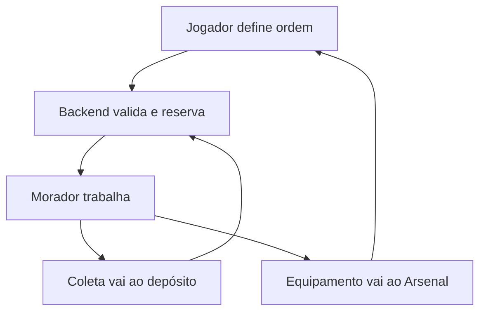
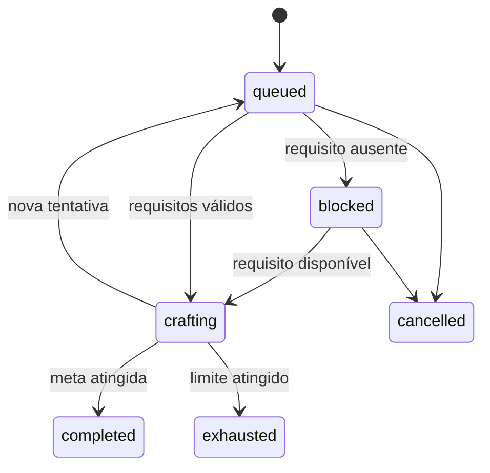

# Atlas — Contexto Mestre para Ajustes no Antigravity IDE

> Documento de handoff técnico da implementação **Assentamento Vivo V1**.  
> Baseline: `2026.08-settlement-v1-residents-desires`  
> Última migration incluída: `000013_settlement_residents_desires.sql`

---

## 1. Prompt inicial para o Antigravity

Cole o bloco abaixo na conversa principal do Antigravity antes de solicitar qualquer alteração:

```text
Você atuará no Project Atlas, um MMORPG Idle classless com backend autoritativo
em Go/PostgreSQL, comunicação WebSocket e frontend React/TypeScript.

O projeto está na versão Assentamento Vivo V1, catálogo
2026.08-settlement-v1-residents-desires, com migrations até 000013.

Antes de modificar qualquer arquivo:
1. Leia integralmente:
   - README.md
   - RELEASE_MANIFEST_SETTLEMENT_V1.md
   - docs/IMPLEMENTATION_REPORT_SETTLEMENT_V1.md
   - docs/KNOWLEDGE_BASE.md
   - docs/REFACTOR_CHANGELOG.md
   - docs/MIGRATION_RUNBOOK_ECONOMY_V2.md
2. Leia os arquivos de código indicados na seção "Mapa da implementação" deste
   documento.
3. Explique o comportamento atual, a causa do problema pontual, os arquivos
   afetados, os riscos e os testes que serão executados.
4. Faça alterações cirúrgicas. Não realize refatorações paralelas não pedidas.
5. Preserve saves, contratos WebSocket, progressão, inventário, combate,
   crafting manual e construções existentes.
6. Nunca altere uma migration já aplicada. Mudanças de schema após a V1 devem
   entrar em 000014 ou superior.
7. Backend e PostgreSQL são autoritativos. O frontend nunca pode decidir custo,
   raridade, duração, recompensa, disponibilidade ou resultado de crafting.
8. Ao finalizar, execute todas as verificações da seção "Quality gate" e
   atualize KNOWLEDGE_BASE.md e REFACTOR_CHANGELOG.md.

Se uma solicitação conflitar com alguma invariante econômica deste documento,
pare e apresente o conflito antes de codificar.
```

---

## 2. Visão do produto implementada

O jogo não trata mais o aventureiro como trabalhador de todas as profissões. A divisão atual é:

| Ator | Responsabilidades atuais |
|---|---|
| Herói | Combate, escolha de expedição, equipamentos, Ambições e construções |
| Jogador | Prioridades, metas de raridade, obras e retirada de itens do Arsenal |
| Moradores | Coleta profissional e produção automática autorizada |
| Backend | Seleção do trabalhador, custos, tempo, raridade, reservas e recompensas |
| PostgreSQL | Estado persistente, idempotência, locks, revisões e histórico econômico |



Construções **não são automáticas**. Um morador não pode construir casa, cabana, armazém ou estação sem uma ordem explícita do jogador.

---

## 3. Estado funcional da V1

### 3.1 Moradores pioneiros

Todo personagem recebe:

| Morador | Habilidades iniciais |
|---|---|
| Tonho Três-Machados | `lumberjack`, `miner` |
| Jurema Puxa-Rede | `fisher`, `tracker` |
| Dona Cida do Chá Suspeito | `farmer`, `herbalist` |

Os níveis anteriores de `character_professions` são copiados para os moradores durante a migration. Depois disso:

- o morador responsável recebe XP individual;
- `character_professions` também recebe o mesmo XP como conhecimento coletivo;
- crafting manual consulta o conhecimento coletivo;
- coleta e produção automática consultam a habilidade individual do morador.

Isso é intencional e não deve ser interpretado como aplicação duplicada de XP ao mesmo atributo.

### 3.2 Ordens de trabalho

- O herói continua combatendo enquanto moradores coletam.
- Moradores distintos podem trabalhar em paralelo.
- Um morador só pode ter uma ocupação efetiva por vez.
- Coleta é determinística, baseada em seed e snapshot.
- O tempo avança com o jogo fechado.
- O jogador ainda precisa reivindicar a produção ao retornar.
- Excedente de armazenamento vira carga pendente, sem perda.
- Uma carga `pending_storage` não deveria manter o trabalhador ocupado.
- O contrato legado `active_gathering` continua existindo; clientes novos usam também `active_gatherings`.

### 3.3 Ambições do Herói

Uma Ambição informa:

- receita de equipamento descoberta;
- raridade mínima;
- catalisador opcional;
- prioridade de `1..100`;
- máximo de `1..20` tentativas.

Limites atuais:

- no máximo 12 Ambições ativas;
- apenas uma Ambição ativa por receita;
- histórico dos 100 estados terminais mais recentes;
- cada tentativa consome custos próprios;
- todos os resultados, inclusive abaixo da meta, são mantidos no Arsenal.

Estados:



Uma tentativa em `crafting` não pode ser cancelada porque ouro e materiais já foram consumidos e reservados para aquela execução.

### 3.4 Arsenal

- Produção automática nunca entra diretamente na mochila.
- Venda automática não alcança o Arsenal.
- Claim valida slots e peso dentro de transação.
- O item só é marcado como retirado após a gravação segura no inventário.
- O Arsenal não possui paginação ou limite próprio nesta V1.

### 3.5 População

A capacidade atual é:

```text
4 vagas base + 4 vagas por nível da Cabana do Aventureiro
```

Na V1, essa capacidade é exibida, mas ainda não existe recrutamento procedural. O assentamento permanece no estágio `camp`.

---

## 4. Mapa da implementação

### Backend — domínio

| Arquivo | Responsabilidade |
|---|---|
| `backend/pkg/game/settlement.go` | Tipos, estados e ordenação de raridades |
| `backend/pkg/game/activity.go` | Coletas múltiplas e vínculo com morador |
| `backend/pkg/game/gathering_simulator.go` | Resultado determinístico e identidade do trabalhador |
| `backend/pkg/game/crafting.go` | Resultado de craft e flag `sent_to_armory` |
| `backend/pkg/game/recipe_registry.go` | Receitas e requisitos autoritativos |
| `backend/pkg/game/building_registry.go` | Construções, níveis e dependências |
| `backend/pkg/game/game_catalog.go` | Versão e payload do catálogo |

### Backend — persistência e transporte

| Arquivo | Responsabilidade |
|---|---|
| `backend/migrations/000013_settlement_residents_desires.sql` | Schema e migração dos saves existentes |
| `backend/internal/db/settlement.go` | Moradores, Ambições, reservas, scheduler e Arsenal |
| `backend/internal/db/economy.go` | Coleta por morador, claims, XP e estado econômico |
| `backend/cmd/server/command_router.go` | Validação, rate limit e handlers WebSocket |
| `backend/cmd/server/ws.go` | Contratos, reconciliação no login e ticker de 5 segundos |

### Frontend

| Arquivo | Responsabilidade |
|---|---|
| `frontend/src/hooks/useGameSocket.ts` | Tipos, estado e comandos WebSocket |
| `frontend/src/components/Economy/EconomyHubModal.tsx` | Trabalhos, Ambições, Arsenal, oficina e moradores |
| `frontend/src/components/Dashboard/DashboardGrid.tsx` | Entrada do hub no Controle de Expedição |

### Auditoria e documentação

| Arquivo | Responsabilidade |
|---|---|
| `tools/audit-economy.mjs` | Cobertura estática da economia e assentamento |
| `tools/audit-content.mjs` | Níveis, loot, monstros e visuais |
| `tools/audit-camp-content.mjs` | Recursos, construções e renderizadores |
| `docs/IMPLEMENTATION_REPORT_SETTLEMENT_V1.md` | Relatório técnico da release |
| `RELEASE_MANIFEST_SETTLEMENT_V1.md` | Escopo e validações da entrega |

---

## 5. Tabelas introduzidas ou alteradas

### Novas tabelas

- `settlements`
- `settlement_residents`
- `settlement_resident_skills`
- `hero_desires`
- `hero_desire_resource_reservations`
- `settlement_armory`

### Tabela alterada

`character_activities` recebeu:

- `resident_id`;
- `resident_name_snapshot`.

### Regra para mudanças futuras

Não editar `000013_settlement_residents_desires.sql` em um banco onde ela já foi aplicada. Qualquer coluna, índice, correção de estado ou backfill novo deve ser criado em:

```text
backend/migrations/000014_nome_da_alteracao.sql
```

O runner aplica arquivos em ordem e registra cada nome em `schema_migrations`.

---

## 6. Contratos WebSocket atuais

### Comandos

```json
{
  "action": "START_GATHERING",
  "expedition_key": "suspicious_logs",
  "duration_seconds": 3600,
  "request_id": "gather_unique"
}
```

```json
{
  "action": "CANCEL_GATHERING",
  "activity_id": "uuid",
  "request_id": "cancel_unique"
}
```

```json
{
  "action": "CLAIM_GATHERING_REWARDS",
  "activity_id": "uuid",
  "request_id": "claim_unique"
}
```

```json
{
  "action": "CREATE_HERO_DESIRE",
  "recipe_key": "craft_espada_do_aprendiz",
  "target_rarity": "epic",
  "catalyst_key": "quality_dust",
  "max_attempts": 5,
  "priority": 50,
  "request_id": "desire_unique"
}
```

```json
{
  "action": "CANCEL_HERO_DESIRE",
  "desire_id": "uuid",
  "request_id": "cancel_desire_unique"
}
```

```json
{
  "action": "CLAIM_ARMORY_ITEM",
  "armory_id": "uuid",
  "request_id": "armory_unique"
}
```

### Compatibilidade obrigatória

- Não remover `active_gathering` de `EconomyState`.
- Novos clientes podem utilizar `active_gatherings`.
- Raridades de entrada podem vir em inglês ou português.
- A persistência usa os nomes canônicos: `Comum`, `Incomum`, `Raro`, `Épico`, `Lendário`.
- IDs e `request_id` continuam obrigatórios para operações mutáveis.

---

## 7. Invariantes que nenhum ajuste pode quebrar

1. Morte, troca de região, coleta, crafting ou construção não podem reduzir nível, XP acumulado, equipamentos, ouro ou descobertas.
2. O herói não pode ser retirado do combate ao iniciar trabalho profissional.
3. Somente o jogador inicia construções.
4. Um mesmo morador não pode coletar e fabricar simultaneamente.
5. Trabalhadores diferentes podem atuar em paralelo.
6. Recursos reservados ficam fora do saldo livre.
7. Ouro, recursos, reserva e estado da tentativa mudam atomicamente.
8. Uma tentativa iniciada usa `recipe_snapshot`, não a versão futura do registry.
9. Produção automática sempre vai ao Arsenal.
10. Claim de Arsenal respeita peso, slots, revisão e transação.
11. Overflow nunca pode apagar silenciosamente recursos ou itens protegidos.
12. Revisões de personagem, inventário, acampamento e recursos não podem retroceder.
13. O backend nunca aceita custo, raridade final ou resultado calculado pelo frontend.
14. `request_id` repetido deve ser idempotente e nunca cobrar novamente.
15. Novas migrations devem ser aditivas e compatíveis com saves legados.

---

## 8. Pontos conhecidos para ajustes pontuais

### P0 — corrigir antes de expandir conteúdo

#### 8.1 Starvation da fila de Ambições

`startNextHeroDesire` escolhe a Ambição de maior prioridade, incluindo estados `blocked`. Se ela continuar bloqueada e o motivo não mudar, chamadas posteriores podem selecionar a mesma linha e impedir que Ambições inferiores, mas executáveis, avancem.

Correção recomendada:

- avaliar uma lista limitada de candidatos em ordem;
- pular candidatos sem trabalhador, estação ou recursos;
- iniciar o primeiro executável;
- preservar em cada bloqueado o motivo correto;
- adicionar teste onde a prioridade 100 está sem recurso e a prioridade 50 consegue iniciar.

Não corrigir apenas mudando a ordenação, pois isso esconderia a prioridade em vez de eliminar o bloqueio.

#### 8.2 Teste real da migration

Executar `000001..000013` em:

- banco vazio;
- cópia anonimizada de banco legado;
- banco com coleta ativa;
- banco com inventário e profissões evoluídas.

Confirmar que a migration cria três pioneiros, copia níveis e não altera progressão do herói.

### P1 — robustez e experiência

#### 8.3 Reconciliação de estado do morador

Criar função idempotente que derive `idle`, `collecting` ou `crafting` a partir das atividades e Ambições persistidas. Executá-la no login para recuperar estados administrativos ou saves inconsistentes.

#### 8.4 Catch-up offline de Ambições

Atualmente uma tentativa pronta é reconciliada no login, e as seguintes continuam pelo ticker online. Ainda não existe simulação encadeada de várias tentativas durante todo o período offline.

Ao implementar:

- limitar janela e número de iterações;
- usar os timestamps históricos em sequência;
- não fabricar uma tentativa que não possuía recursos naquele instante;
- registrar cada tentativa separadamente;
- garantir paridade entre online e offline.

#### 8.5 Crescimento do Arsenal

Cada tentativa mantém o item, inclusive resultados abaixo da meta. O Arsenal ainda não possui paginação ou capacidade.

Antes de alterar, decidir com o jogador entre:

- manter tudo;
- auto-reciclar raridades abaixo de uma regra;
- enviar excedentes para depósito comercial;
- impor capacidade melhorável por construção.

Nunca destruir um item existente por padrão em uma migration.

#### 8.6 Preview de Ambição

Antes de confirmar, a UI pode mostrar:

- materiais e ouro por tentativa;
- custo máximo teórico;
- duração por tentativa;
- chances de cada raridade;
- artesão elegível;
- estação necessária;
- motivo provável de bloqueio.

O preview deve vir do backend e carregar revisão/versão para impedir confirmação obsoleta.

#### 8.7 Paginação

Planejar paginação para histórico de Ambições e Arsenal. Não enviar indefinidamente todos os registros no `WELCOME_EVENT`.

#### 8.8 Balanceamento de Drops de Monstros (Ajuste de Frequência)

- Frequência de drops de partes de monstros em combates comuns está elevada.
- Ajustar `DropChance` em `backend/pkg/game/loot.go` para matérias-primas de mobs normais (reduzir de 35% para ~15%-20%).
- Manter Bosses com drops garantidos/especiais de manuais/livros e adicionar chance baixa de drop surpresa de equipamentos raros.

#### 8.9 Coleta Contínua e Depósito Automático

- Moradores devem depositar recursos automaticamente no depósito (`character_resources`) sem exigir clique manual do jogador em "Receber produção".
- Moradores devem poder continuar coletando em loop contínuo enquanto houver espaço/ordem ativa.
- Exibir os recursos sendo colhidos em tempo real na interface enquanto trabalham.

#### 8.10 Melhorias na Fila de Ambições & Limpeza de Cancelados

- Exibir detalhes completos da receita e ingredientes ao clicar nos cards da fila de Ambições.
- Melhorar a mensagem de bloqueio para indicar o morador específico (ex: *"Requer Tonho Três-Machados (Lumberjack Nv. 1)"*).
- Ocultar ambições em estado `CANCELLED` da fila principal para evitar poluição visual.

#### 8.11 Expansão da Arena 2D e Layout do Dashboard

- Aumentar a resolução/tamanho do container da Arena 2D (atualmente em `500x260px`).
- Reorganizar o `DashboardGrid` para dar maior destaque à arena e à visualização gráfica do assentamento.

#### 8.12 Atualização dos Compêndios de Loot

- Ajustar o Compêndio de Exploração para exibir matérias-primas e partes de monstros para mobs comuns.
- Reservar slots de equipamentos raros apenas para os Bosses no compêndio.

#### 8.13 Oficina Manual: Multi-Craft e Correção de Conflito de Revisão

- Corrigir erro `❌ a oficina mudou; revise os custos` atualizando a revisão do estado no frontend imediatamente após cada craft.
- Implementar seletor de quantidade ($1..100$) para permitir múltiplos processamentos de uma só vez na Oficina Manual.

### P2 — expansão do conceito

- recrutamento de novos moradores;
- chegada baseada em reputação, moradia e prosperidade;
- casas e famílias;
- mapa visual do assentamento com trabalhadores;
- especializações e traços reais;
- necessidades, felicidade e produtividade;
- mercado, visitas, alianças e ataques entre jogadores.

Essas funcionalidades não existem na V1 e não devem ser simuladas apenas no frontend.

---

## 9. Processo cirúrgico para cada solicitação

### Etapa 1 — diagnóstico

Antes de editar, responder:

1. Qual é o comportamento atual?
2. Qual comportamento é desejado?
3. A mudança afeta save, banco, economia ou contrato?
4. Quais invariantes precisam ser preservadas?
5. É necessário criar migration `000014+`?

### Etapa 2 — desenho da mudança

Apresentar:

- arquivos afetados;
- contratos antes/depois;
- transações e locks;
- tratamento de idempotência;
- compatibilidade com cliente/save anterior;
- testes e rollback.

### Etapa 3 — implementação

Ordem recomendada:

1. migration aditiva, quando necessária;
2. tipos e regras puras do domínio;
3. persistência transacional;
4. handler WebSocket;
5. tipos e hook do frontend;
6. UI;
7. testes, auditorias e documentação.

### Etapa 4 — revisão

Verificar especificamente:

- consumo ou crédito duplicado;
- corrida entre ticker de combate e scheduler;
- downgrade de revisões;
- seleção simultânea do mesmo morador;
- claim repetido;
- mochila ou depósito cheio;
- desconexão durante produção;
- atualização de catálogo durante ordem;
- compatibilidade de raridade inglês/português.

---

## 10. Cenários mínimos de teste

| Cenário | Resultado esperado |
|---|---|
| Save antigo entra pela primeira vez | Progressão preservada e três pioneiros criados |
| Herói caçando inicia coleta | Caçada continua e morador fica `collecting` |
| Dois moradores diferentes recebem ordens | Duas atividades coexistem |
| Duas ordens concorrentes tentam usar o mesmo morador | Apenas uma inicia |
| Coleta termina com depósito cheio | Excedente fica pendente e morador é liberado após claim |
| Ambição sem materiais | Estado `blocked`, sem cobrança |
| Materiais chegam depois | Ambição volta a ser elegível |
| Ambição inicia | Ouro e materiais são debitados uma única vez |
| Resultado abaixo da meta | Item vai ao Arsenal e nova tentativa é enfileirada |
| Resultado atinge a meta | Estado `completed` e item permanece no Arsenal |
| Limite é atingido | Estado `exhausted`, sem nova cobrança |
| Claim repetido do Arsenal | Segundo claim falha sem duplicar item |
| Mochila cheia | Item continua no Arsenal |
| Registry muda após criação | Ordem usa `recipe_snapshot` |
| Ambição bloqueada prioridade 100 + executável prioridade 50 | A prioridade 50 consegue iniciar |
| Desconectar e reconectar | Estados e timers continuam consistentes |

---

## 11. Quality gate obrigatório

```bash
cd backend
go test -race ./...

cd ../frontend
npx tsc --noEmit
npm run build

cd ..
node tools/audit-content.mjs
node tools/audit-camp-content.mjs
node tools/audit-economy.mjs
```

Também executar, quando houver mudança de banco:

```bash
docker compose up --build
docker compose logs -f backend
```

Validar em PostgreSQL:

```sql
SELECT version, applied_at
FROM schema_migrations
ORDER BY version;
```

O build atual emite aviso de chunk JavaScript acima de 500 kB. É aviso conhecido, não erro funcional. Code splitting deve ser tratado em tarefa isolada.

---

## 12. Definition of Done

Um ajuste só está concluído quando:

- resolve apenas o escopo solicitado;
- não altera migrations já aplicadas;
- possui teste do caminho feliz e do principal caso de falha;
- preserva idempotência e revisões;
- funciona com mochila/depósito cheio;
- mantém combate e coleta paralelos;
- mantém construções sob controle do jogador;
- passa em Go, TypeScript, build e três auditorias;
- atualiza `docs/KNOWLEDGE_BASE.md`;
- registra a mudança em `docs/REFACTOR_CHANGELOG.md`;
- informa arquivos modificados, riscos residuais e roteiro de homologação.

---

## 13. Modelo de pedido pontual para usar no Antigravity

```text
Com base no documento PLANO_CONTEXTO_ANTIGRAVITY_ASSENTAMENTO_V1.md, faça o
seguinte ajuste pontual:

[DESCREVER UMA ÚNICA MUDANÇA]

Antes de codificar, apresente:
1. diagnóstico no código atual;
2. arquivos que serão modificados;
3. impacto em banco/save/WebSocket;
4. invariantes afetadas;
5. plano de testes.

Depois implemente de forma cirúrgica, crie migration 000014+ se houver mudança
de schema, preserve contratos legados, execute o quality gate completo e
entregue um resumo com riscos residuais.
```

Para reduzir regressões, use uma conversa/tarefa separada do Antigravity para cada mudança independente.
