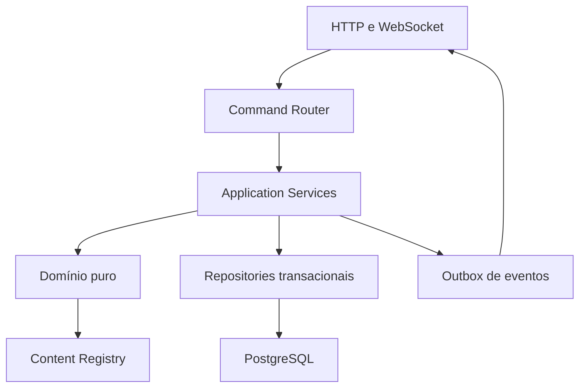
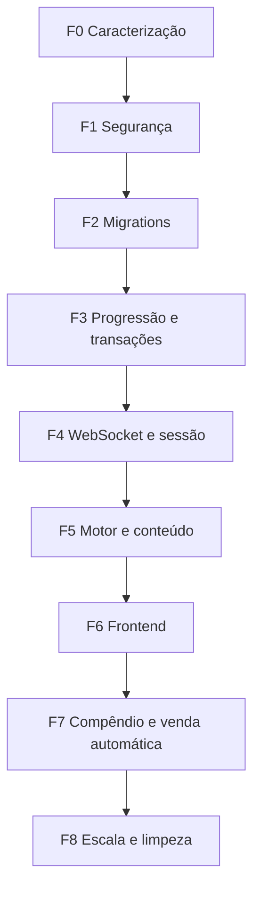

# Plano Mestre de Refatoração Arquitetural — Atlas MMORPG V5

> **Status (2026-08-27):** plano mestre histórico. Algumas fases foram
> implementadas e outras foram superadas por contratos novos; não use este
> arquivo para inferir o estado atual sem consultar [`DOCUMENTATION_STATUS.md`](DOCUMENTATION_STATUS.md).

## Segurança, Integridade, Progressão, Motor Modular, Conteúdo Data-Driven, WebSocket, Frontend e Sistemas Idle

**Base analisada:** snapshot `repomix-output.xml`  
**Estratégia:** refatoração cirúrgica, incremental e retrocompatível  
**Destino:** execução assistida pela IDE Antigravity

---

## 1. Objetivo deste plano

Este documento consolida as melhorias arquiteturais identificadas no projeto e integra os sistemas planejados de:

- Compêndio de Exploração e descoberta progressiva de loot;
- venda automática customizável;
- Baú de Achados da Expedição;
- conteúdo modular para novas regiões, monstros, itens, habilidades e construções;
- progressão correta por nível e chefes;
- consistência total entre jogo online e progresso offline;
- segurança e operação do backend;
- contratos WebSocket confiáveis;
- redução dos monólitos Go e React;
- testes, auditoria, observabilidade e rollout seguro.

O objetivo não é trocar toda a tecnologia nem reescrever o jogo. O objetivo é criar fronteiras claras ao redor do código funcional, migrar responsabilidade por responsabilidade e remover o legado somente depois que o novo caminho estiver comprovado.

---

## 2. Resultado esperado

Ao final da refatoração:

1. adicionar uma expedição exigirá declarar conteúdo e implementar apenas os visuais que forem realmente novos;
2. nomes visíveis poderão ser alterados sem quebrar saves, loot, compêndio ou regras automáticas;
3. progressão por chefe e nível terá uma única regra autoritativa;
4. ouro, inventário, recursos, descobertas e progresso serão persistidos atomicamente;
5. online e offline utilizarão os mesmos calculadores de regras e recompensas;
6. eventos econômicos WebSocket não serão descartados silenciosamente;
7. o backend poderá ser observado, testado e futuramente escalado horizontalmente;
8. frontend não deduzirá tipo de item, regra ou fórmula por nome;
9. o jogador poderá personalizar a venda automática sem risco de perda involuntária;
10. novas funcionalidades não precisarão ampliar `engine.go`, `ws.go`, `useGameSocket.ts` ou componentes gigantes.

---

## 3. Premissas inegociáveis

### 3.1. Backend autoritativo

O frontend apresenta, solicita e anima. O backend decide:

- se uma região pode ser acessada;
- dano, crítico, cura e custo de habilidade;
- recompensa e raridade;
- capacidade de inventário;
- elegibilidade e preço de venda;
- construção, recursos e duração;
- descoberta de loot;
- progressão online e offline.

### 3.2. Identidade estável

Entidades de conteúdo usam chaves permanentes:

```text
region_key
monster_key
item_template_key
skill_key
building_key
resource_key
visual_key
```

`name` é somente texto de exibição. IDs de instância continuam sendo usados para cópias específicas de itens, construções em progresso e eventos.

### 3.3. Uma mutação econômica, uma transação

Qualquer ação que altere dois ou mais destes elementos precisa ser atômica:

- ouro;
- inventário;
- equipamento;
- recursos;
- descobertas;
- construções;
- recompensas offline;
- overflow;
- experiência.

### 3.4. Sem big bang

Cada módulo novo deve entrar por adaptador ou feature flag. O comportamento antigo permanece disponível até que:

- testes passem;
- métricas confirmem o novo fluxo;
- rollback tenha sido validado;
- saves legados sejam reconciliados.

### 3.5. Sem I/O dentro do núcleo puro

Fórmulas, seleção de loot, política de venda, progressão e combate devem ser funções determinísticas. Banco, relógio, RNG, logs e WebSocket ficam nas camadas externas.

---

## 4. Diagnóstico executivo do código atual

### 4.1. Pontos positivos que devem ser preservados

- `MonsterContentRegistry` já introduz identidade canônica para monstros;
- catálogo autoritativo do backend já alimenta parte do frontend;
- recursos do acampamento usam snapshot com capacidade e revisão;
- claim offline usa transação `SERIALIZABLE` e `FOR UPDATE`;
- conteúdo possui testes e scripts de auditoria;
- renderização já começou a ser organizada por registries;
- habilidades e efeitos possuem chaves próprias;
- construções, recursos, desmontagem e blueprints já possuem domínios reconhecíveis.

### 4.2. Riscos críticos

| Área | Evidência no snapshot | Risco |
|---|---|---|
| JWT | segredo hardcoded em `main.go` | falsificação de tokens se o código for exposto |
| CORS | aceita `http://*` e `https://*` com credenciais | origem não confiável acessando a aplicação |
| WebSocket | `CheckOrigin` sempre retorna `true` | conexão cross-origin sem controle |
| Administração | `AdminMiddleware` apenas chama o próximo handler | qualquer autenticado acessa rota administrativa |
| Telemetria | RAM, uptime, Redis e banco são valores fixos | diagnóstico falso em produção |
| Banco | servidor continua após falha no PostgreSQL | aplicação parcialmente iniciada e mutações quebradas |
| Persistência | várias chamadas `_ = Save...` e `_, _ = tx.Exec` | estado em memória divergente do banco |
| Progressão | região é liberada por nível e `SelectRegion` não exige unlock | pré-requisito de chefe pode ser contornado |
| WebSocket | canal cheio descarta evento no `default` | inventário e recursos podem ficar desatualizados |
| Migrações | SQL em migrations, `InitDB`, bootstrap e arquivos paralelos | schema imprevisível e erros ignorados |

### 4.3. Dívida estrutural

- `engine.go` possui aproximadamente 1.966 linhas;
- `BiomeRenderers.ts` possui aproximadamente 1.264 linhas;
- renderer de monstros Tier 2 possui aproximadamente 969 linhas;
- `TibiaBackpackModal.tsx` possui aproximadamente 802 linhas;
- `GameViewport.ts` possui aproximadamente 701 linhas;
- `useGameSocket.ts` possui aproximadamente 552 linhas;
- regras online e offline ainda possuem implementações paralelas;
- existe conteúdo legado no banco concorrendo com registries Go;
- o frontend ainda classifica itens por palavras existentes no nome;
- auditorias Node analisam código Go com expressões regulares.

---

## 5. Arquitetura-alvo



### 5.1. Camadas

#### Transporte

- autenticação;
- parsing e validação do comando;
- correlação por `request_id`;
- serialização da resposta;
- conexão WebSocket;
- mapeamento de erros públicos.

#### Aplicação

- coordena casos de uso;
- abre transações;
- carrega estado;
- chama domínio;
- persiste resultado;
- produz eventos;
- não contém fórmulas de jogo.

#### Domínio

- combate;
- progressão;
- recompensa;
- inventário;
- loot;
- venda;
- construções;
- capacidade;
- disponibilidade de região.

#### Infraestrutura

- PostgreSQL;
- migrations;
- relógio;
- RNG;
- logs;
- métricas;
- locks e leases de sessão.

#### Conteúdo

- definições declarativas;
- registries imutáveis;
- aliases legados;
- validação de referências;
- versão e checksum.

---

## 6. Frente A — segurança e configuração

### 6.1. Segredos e ambiente

Substituir:

```go
var jwtSecret = []byte("atlas_super_secret_jwt_key_2026")
```

por configuração validada:

```go
type AppConfig struct {
    Environment    string
    JWTSecret      []byte
    AllowedOrigins []string
    DatabaseURL    string
    HTTPPort       string
}
```

Regras:

- `JWT_SECRET` obrigatório fora de `development` e `test`;
- tamanho mínimo recomendado de 32 bytes aleatórios;
- validar explicitamente `HS256` ao interpretar o token;
- não registrar token ou senha em log;
- remover credenciais padrão em produção;
- habilitar SSL do PostgreSQL conforme ambiente.

### 6.2. CORS e WebSocket

- carregar origens permitidas por configuração;
- rejeitar `Origin` desconhecida no WebSocket;
- não combinar origem ampla com `AllowCredentials=true`;
- em desenvolvimento permitir somente `localhost` e portas configuradas;
- considerar ticket WebSocket curto em vez de JWT longo na query string.

### 6.3. Administração

Adicionar `Role` às claims e validar:

```go
if claims.Role != "admin" {
    jsonError(w, http.StatusForbidden, "acesso não autorizado")
    return
}
```

Separar:

- `/health/live`: processo ativo;
- `/health/ready`: banco e dependências prontas;
- `/metrics`: protegido ou disponível somente na rede interna;
- `/api/v1/admin/*`: somente administrador.

### 6.4. Autenticação

- normalizar email;
- limitar tamanho de email, senha e nome do personagem;
- adicionar rate limit para login e cadastro;
- garantir política mínima de senha;
- incluir `Issuer`, `Audience`, `IssuedAt` e `ExpiresAt` no JWT;
- retornar erros genéricos no login;
- adicionar graceful shutdown e timeouts no `http.Server`.

### 6.5. Critérios de aceite

- servidor de produção não sobe sem segredo e banco;
- origem não autorizada não abre WebSocket;
- jogador comum recebe `403` em rota administrativa;
- health não informa dependência saudável quando ela falha;
- nenhum segredo aparece no repositório ou nos logs.

---

## 7. Frente B — migrations e governança do banco

### 7.1. Fonte única de schema

Escolher `backend/migrations` como única fonte de mudanças estruturais.

Remover gradualmente de `InitDB`:

- `ALTER TABLE` dinâmico;
- `CREATE INDEX` solto;
- `CREATE TABLE` do acampamento;
- updates de backfill sem versão;
- erros ignorados.

Usar `golang-migrate`, `goose` ou runner equivalente com tabela de versão.

### 7.2. Bootstrap estático

`BootstrapStaticData` não deve apagar e repopular `base_monsters` em todo startup.

Escolher uma destas políticas:

1. remover tabelas legadas se não tiverem consumidores;
2. migrar conteúdo necessário para manifests versionados;
3. manter seeds somente para ambiente local/teste.

Nunca executar `DELETE` de conteúdo autoritativo na inicialização de produção.

### 7.3. Global `DB`

Substituir `var DB *sql.DB` por dependência explícita:

```go
type Repositories struct {
    DB *sql.DB
}
```

Ou repositórios menores:

```go
type CharacterRepository struct { db *sql.DB }
type InventoryRepository struct { db *sql.DB }
type CampRepository struct { db *sql.DB }
```

Isso permite testes com banco isolado e reduz acoplamento.

### 7.4. Ledger e idempotência

Criar ledger para mutações econômicas relevantes:

```sql
CREATE TABLE economy_ledger (
    id UUID PRIMARY KEY,
    character_id UUID NOT NULL REFERENCES characters(id),
    request_id VARCHAR(120),
    operation_type VARCHAR(60) NOT NULL,
    gold_delta BIGINT NOT NULL DEFAULT 0,
    payload JSONB NOT NULL DEFAULT '{}',
    created_at TIMESTAMPTZ NOT NULL DEFAULT NOW(),
    UNIQUE(character_id, request_id)
);
```

Operações destrutivas ou creditícias devem possuir `request_id` e serem idempotentes.

### 7.5. Critérios de aceite

- banco novo nasce somente com migrations;
- banco existente sobe por todas as versões sem perder dados;
- migration com erro interrompe deploy;
- executar startup duas vezes não apaga conteúdo;
- testes integram PostgreSQL real.

---

## 8. Frente C — identidade canônica e conteúdo autoritativo

### 8.1. Eliminar o sistema sombra

Auditar e remover, caso confirmados como legados:

- `base_items`;
- `base_monsters`;
- `BaseItems`;
- `DBBaseMonsters`;
- `GetRandomLoot` legado;
- `GetLootFunc` sem consumidor real;
- `inferAttackType` por nome.

O caminho esperado passa a ser:

```text
RegionDefinition
  → MonsterDefinition
    → MonsterLootProfile
      → ItemTemplate
```

### 8.2. Chaves de template

Adicionar `Key` a `LootTemplate` e `TemplateKey` a `Item`. Perfis de monstro passam a referenciar chaves, não nomes.

Aliases por nome permanecem somente para reconciliar saves antigos.

### 8.3. Conteúdo data-driven

Estrutura recomendada:

```text
backend/content/
├── schema/
├── regions/
│   ├── tier_01.json
│   ├── tier_02.json
│   └── ...
├── monsters/
├── loot_profiles/
├── items/
├── skills/
├── resources/
└── buildings/
```

Os arquivos podem ser incorporados ao binário com `//go:embed`, garantindo deploy autocontido.

Manter no código apenas comportamentos complexos. Dados como nome, nível, HP, ataque, custo, duração, requisitos e chaves devem ser declarativos.

### 8.4. Registry agregado

```go
type ContentRegistry struct {
    Regions      RegionRegistry
    Monsters     MonsterRegistry
    Items        ItemTemplateRegistry
    LootProfiles LootProfileRegistry
    Skills       SkillRegistry
    Resources    ResourceRegistry
    Buildings    BuildingRegistry
    Version      string
    Checksum     string
}
```

O registry é montado e validado no startup. Depois disso é somente leitura.

### 8.5. Validações obrigatórias

- chaves únicas e não vazias;
- `Order` único ou regra explícita de desempate;
- região referenciada existe;
- `RequiresUnlockFrom` existe e não cria ciclo;
- monstro está dentro do intervalo da região;
- boss também respeita o intervalo;
- loot profile existe para todo monstro;
- item referenciado existe;
- tier e nível do item são coerentes;
- `visual_key` possui renderer ou fallback explícito;
- skill permitida possui efeito e visual registrado;
- construção referencia recursos válidos;
- nenhuma recompensa obrigatória fica inalcançável.

No snapshot, `planalto` e `rogartes` compartilham `Order: 6`; a auditoria deve detectar esse tipo de ambiguidade.

### 8.6. Estratégia de migração

1. adicionar chaves mantendo nomes;
2. popular aliases;
3. reconciliar saves;
4. migrar perfis para chaves;
5. mudar catálogo;
6. observar templates não resolvidos;
7. remover lookup principal por nome.

---

## 9. Frente D — progressão e disponibilidade de expedições

### 9.1. Regra única

Hoje nível e desbloqueio de chefe se sobrepõem de modo contraditório. Criar:

```go
type RegionAvailability struct {
    Available bool
    Reason    string
    RequiredLevel int
    RequiredBossKey string
}

func CanEnterRegion(char CharacterProgress, region RegionDefinition) RegionAvailability
```

Política recomendada:

```text
região inicial: desbloqueada por padrão
região encadeada: nível suficiente AND pré-requisito concluído
região sem pré-requisito: apenas nível suficiente
região secreta: regra explícita de descoberta
```

### 9.2. Backend e frontend

`SelectRegion` deve chamar `CanEnterRegion`. O frontend não deve recriar a regra com `OR` ou `AND`; o catálogo/snapshot deve trazer:

```json
{
  "region_id": "rogartes",
  "available": false,
  "lock_reason": "Derrote Esquelético Pacato e alcance o nível 12"
}
```

### 9.3. Progressão por chefe

Registrar explicitamente a conclusão:

```sql
CREATE TABLE character_region_progress (
    character_id UUID NOT NULL REFERENCES characters(id) ON DELETE CASCADE,
    region_key VARCHAR(80) NOT NULL,
    bosses_defeated BIGINT NOT NULL DEFAULT 0,
    expeditions_completed BIGINT NOT NULL DEFAULT 0,
    highest_stage INT NOT NULL DEFAULT 1,
    first_completed_at TIMESTAMPTZ,
    last_completed_at TIMESTAMPTZ,
    PRIMARY KEY(character_id, region_key)
);
```

`UnlockedRegions` pode continuar durante a migração, mas o progresso estruturado passa a ser a fonte de verdade.

### 9.4. Remover números fixos

Substituir mensagens como:

```text
FASE 5/5
FASE FINAL 5/5
```

por `CurrentStage/MaxStages`.

Também tornar declarativos:

- quantidade de monstros por fase;
- existência de guarda-costas;
- composição da fase boss;
- recompensa de conclusão;
- próximo desbloqueio.

### 9.5. Testes

- nível sem chefe não entra em região encadeada;
- chefe sem nível não entra;
- ambos atendidos entram;
- região inicial sempre disponível;
- ciclos de unlock falham na auditoria;
- frontend apresenta o motivo retornado pelo backend;
- online e offline desbloqueiam a mesma região.

---

## 10. Frente E — persistência transacional e estado de sessão

### 10.1. Problema atual

`GameSession` altera memória e chama callbacks separados para personagem, inventário e recursos. Alguns erros são ignorados.

### 10.2. Application services

Criar casos de uso explícitos:

```text
AcquireLoot
SellInventoryItems
EquipItem
UnequipItem
AllocateStat
SelectRegion
LearnSkill
LearnBlueprint
StartBuildingUpgrade
SalvageItems
ClaimOfflineProgress
```

Cada serviço:

1. carrega estado sob lock/revisão;
2. valida comando;
3. chama domínio puro;
4. persiste tudo;
5. registra ledger/outbox;
6. confirma transação;
7. retorna snapshot autoritativo;
8. atualiza sessão somente após commit.

### 10.3. Revisões

Separar revisões quando necessário:

- `character_revision`;
- `inventory_revision`;
- `camp_revision`;
- `resources_revision`.

O cliente envia `expected_revision` em operações concorrentes. Em conflito, o servidor retorna snapshot atualizado.

### 10.4. Erros

Remover `_ = Save...` das mutações. Classificar erros:

```go
type DomainError struct {
    Code    string
    Message string
    Cause   error
}
```

O cliente recebe código e mensagem segura; logs recebem a causa completa e `request_id`.

### 10.5. Caso de mochila menor

Antes de equipar/desquipar bolsa:

- calcular capacidade projetada;
- bloquear operação inválida;
- opcionalmente oferecer overflow mediante confirmação;
- nunca vender ou descartar silenciosamente devido à troca.

---

## 11. Frente F — modularização do motor de jogo

### 11.1. Responsabilidades atuais a separar

`engine.go` mistura estado, tick, combate, progressão, loot, inventário, habilidades, persistência e eventos.

Estrutura-alvo:

```text
backend/pkg/game/
├── session/
│   ├── state.go
│   ├── loop.go
│   └── commands.go
├── combat/
│   ├── engine.go
│   ├── movement.go
│   ├── damage.go
│   ├── skills.go
│   └── status_effects.go
├── expedition/
│   ├── state_machine.go
│   ├── spawn.go
│   ├── availability.go
│   └── progression.go
├── rewards/
│   ├── calculator.go
│   ├── loot_roll.go
│   └── experience.go
├── inventory/
│   ├── capacity.go
│   ├── equipment.go
│   ├── sale_policy.go
│   └── salvage.go
└── content/
```

### 11.2. State machine de expedição

Estados sugeridos:

```text
CampResting
Recovering
ExpeditionStarting
WaveSpawning
CombatActive
WaveCompleted
BossSpawning
ExpeditionCompleted
Defeated
```

Transições explícitas evitam combinações inconsistentes de flags como:

- `IsExpeditionActive`;
- `RecoveringFromDefeat`;
- `AutoResumePending`;
- `IsBossStage`;
- `CurrentMonsters` vazio.

### 11.3. Relógio e RNG injetáveis

```go
type Clock interface { Now() time.Time }
type RNG interface {
    Float64() float64
    Intn(int) int
}
```

Manter um RNG por sessão ou simulação. Não recriar `rand.New` em cada tick. Isso permite reproduzir bugs e escrever testes determinísticos.

### 11.4. Actor por sessão — fase posterior

Como evolução, usar um loop único de comandos por personagem:

```text
tick
ação WebSocket
resultado de persistência
timer de construção
desconexão
```

Isso reduz disputa de mutex. Para manter a refatoração cirúrgica, primeiro extrair funções puras e serviços; migrar para actor somente depois.

---

## 12. Frente G — paridade online/offline

### 12.1. O que deve ser compartilhado

Online e offline não precisam usar o mesmo loop visual, mas devem compartilhar:

- `CalculateDerivedStats`;
- `CalculateKillXP`;
- `CalculateGoldReward`;
- `RollMonsterLoot`;
- `RollMonsterResources`;
- `ApplyExperienceAndLevelUps`;
- `UnlockRegionsAfterBoss`;
- `EvaluateLootAcquisition`;
- `SalePriceCalculator`;
- regras de habilidades relevantes à eficiência.

### 12.2. Offline incremental

Remover `MaximumOfflineItems = 50` como regra econômica. Limitar somente o payload do relatório.

Durante a simulação:

- manter inventário de trabalho;
- aplicar venda automática;
- registrar descobertas em set;
- agregar itens vendidos por template/raridade;
- guardar somente amostras para exibição;
- persistir resultado no claim transacional.

### 12.3. Teste de paridade

Para uma sequência determinística de monstros e rolls:

- recompensa base igual;
- mesmo item gerado;
- mesma descoberta;
- mesma disposição de inventário;
- mesmo preço;
- mesmo unlock;
- divergências intencionais documentadas.

---

## 13. Frente H — WebSocket confiável e versionado

### 13.1. Roteador de comandos

Substituir o `switch` crescente por registry:

```go
type CommandHandler interface {
    Handle(ctx CommandContext, payload json.RawMessage) (CommandResult, error)
}

handlers := map[string]CommandHandler{
    "TOGGLE_EXPEDITION": ToggleExpeditionHandler,
    "EQUIP_ITEM": EquipItemHandler,
    // ...
}
```

Cada payload recebe tipo próprio. O `ClientAction` genérico deixa de acumular campos irrelevantes.

### 13.2. Envelope

Cliente → servidor:

```json
{
  "protocol_version": 2,
  "request_id": "uuid",
  "action": "EQUIP_ITEM",
  "expected_revision": 42,
  "payload": {
    "item_id": "item-123",
    "slot": "mainhand"
  }
}
```

Servidor → cliente:

```json
{
  "protocol_version": 2,
  "event_id": "uuid",
  "sequence": 918,
  "request_id": "uuid-opcional",
  "type": "INVENTORY_UPDATED",
  "state_revision": 43,
  "payload": {}
}
```

### 13.3. Backpressure

Classificar eventos:

| Classe | Exemplos | Pode descartar? |
|---|---|---|
| Crítico | ouro, inventário, construção, descoberta | Não |
| Estado | HP, mana, monstros, fase | Pode ser substituído por snapshot mais novo |
| Efêmero | partícula, texto de dano, som | Sim, com métrica |

Não usar `default` silencioso para eventos críticos.

### 13.4. Resync

Adicionar:

```text
REQUEST_STATE_SYNC
STATE_SNAPSHOT
```

O cliente solicita snapshot se:

- detectar salto de `sequence`;
- receber conflito de revisão;
- reconectar;
- falhar ao validar um evento.

### 13.5. Payload e frequência

- `WELCOME_EVENT` contém snapshot completo;
- ticks enviam deltas de HP/mana/monstros;
- inventário somente quando muda;
- recursos somente quando mudam;
- snapshot periódico a cada 15–30 segundos como rede de segurança;
- calcular `DerivedStats` uma vez por mutação, não repetidamente no broadcast.

---

## 14. Frente I — sessão, escala e desempenho

### 14.1. Sessões em memória

`activeSessions` e lifecycle locks funcionam em uma única instância. Antes de escalar:

- documentar necessidade de sticky session;
- criar lease por personagem no PostgreSQL ou Redis;
- impedir duas instâncias de abrir o mesmo personagem;
- heartbeat e expiração para sessões abandonadas;
- remover locks de `sync.Map` quando não forem mais usados.

### 14.2. Reconciliação de construções

Não consultar o banco a cada 750 ms por jogador no acampamento.

Nova estratégia:

- reconciliar no login;
- reconciliar ao abrir o acampamento;
- agendar timer para o menor `upgrade_ends_at`;
- fallback periódico de 10–30 segundos;
- timer gera comando no loop da sessão.

### 14.3. Cache e estado derivado

- recalcular stats apenas quando atributo, equipamento, postura ou buff mudar;
- usar flag `statsDirty`;
- não clonar inventário completo em todo tick;
- limitar logs de batalha no cliente e servidor;
- medir duração do tick e tamanho médio dos eventos.

### 14.4. Capacidade

Definir limites operacionais:

- máximo de sessões por instância;
- tamanho máximo do canal de eventos;
- timeout de comandos;
- tamanho máximo do inventário/overflow;
- limite de ações por segundo por personagem;
- desconexão de cliente que não consome eventos críticos.

---

## 15. Frente J — frontend tipado e modular

### 15.1. Estado do jogo

Separar `useGameSocket.ts`:

```text
frontend/src/game/network/
├── GameSocketClient.ts
├── protocol.ts
├── schemas.ts
├── commands.ts
└── reconnect.ts

frontend/src/game/state/
├── gameReducer.ts
├── initialState.ts
├── selectors.ts
└── GameProvider.tsx
```

### 15.2. Eventos discriminados

```ts
type ServerEvent =
  | { type: 'STATE_SNAPSHOT'; payload: StateSnapshot }
  | { type: 'INVENTORY_UPDATED'; payload: InventorySnapshot }
  | { type: 'LOOT_DISCOVERED'; payload: LootDiscovery }
  | { type: 'AUTO_SELL_COMPLETED'; payload: AutoSellResult }
  | { type: 'COMBAT_EFFECT'; payload: CombatEffect };
```

Validar JSON em runtime com schemas. Mensagem inválida gera log, métrica e resync; não entra diretamente no estado React.

### 15.3. Reconnect

- backoff exponencial com jitter;
- reset após conexão estável;
- snapshot obrigatório após reconexão;
- cancelar timers corretamente no unmount;
- distinguir offline real, servidor indisponível e token expirado.

### 15.4. Remover inferências por nome

Substituir verificações como `name.includes('mochila')` por:

- `slot_type`;
- `item_kind`;
- `template_key`;
- `icon_key`;
- `visual_key`.

Fórmulas de crítico, mana e capacidade não devem ser recalculadas como fallback no frontend. O backend envia `DerivedStats` autoritativo.

### 15.5. Componentes grandes

Dividir `TibiaBackpackModal` em:

```text
BackpackModal
BackpackToolbar
BackpackFilters
BackpackGrid
EquipmentPanel
ItemTooltip
BulkActionBar
AutoSellSettingsModal
OverflowPanel
```

Dividir dashboard por painéis e usar selectors para evitar props excessivas.

---

## 16. Frente K — renderização e conteúdo visual

### 16.1. Registries visuais

Manter registries por `visual_key`, mas dividir arquivos grandes:

```text
renderers/monsters/
├── forest/
├── shereque/
├── esgotos/
├── planalto/
└── shared/
```

Cada renderer deve expor somente desenho. Primitivas reutilizáveis ficam em `shared`:

- olhos;
- sombras;
- armas;
- armaduras;
- partículas;
- auras;
- indicadores de boss.

### 16.2. Bosses

Definição visual pode informar:

```ts
interface MonsterVisualDefinition {
  key: string;
  renderer: MonsterRenderer;
  baseSize: number;
  bossScale?: number;
  shadowScale?: number;
  auraKey?: string;
  entranceEffectKey?: string;
}
```

Assim o engine não precisa saber como um boss fica imponente.

### 16.3. Biomas

Separar camadas:

- céu;
- fundo distante;
- cenário médio;
- terreno;
- props;
- iluminação/clima;
- animação.

O manifesto da região referencia um `biome_key`; o frontend resolve o renderer.

### 16.4. Cache

- chave de cache inclui `visual_key`, tamanho e variante;
- política de invalidação em mudança de catálogo/tema;
- limites para canvases armazenados;
- fallback visual explícito para chave desconhecida.

---

## 17. Frente L — Compêndio de Exploração

### 17.1. Catálogo real

O denominador regional é a união de loot dos monstros e do boss. `DropsPreview` torna-se apenas curadoria de destaque.

### 17.2. Persistência

```sql
CREATE TABLE character_loot_discoveries (
    character_id UUID NOT NULL REFERENCES characters(id) ON DELETE CASCADE,
    item_template_key VARCHAR(120) NOT NULL,
    first_region_key VARCHAR(80),
    first_monster_key VARCHAR(120),
    first_discovered_at TIMESTAMPTZ NOT NULL DEFAULT NOW(),
    last_found_at TIMESTAMPTZ NOT NULL DEFAULT NOW(),
    times_found BIGINT NOT NULL DEFAULT 1,
    highest_rarity VARCHAR(24) NOT NULL DEFAULT 'Comum',
    PRIMARY KEY(character_id, item_template_key)
);
```

### 17.3. Retrocompatibilidade

- varrer mochila e equipamento;
- resolver template legado;
- registrar descoberta;
- não inventar região/monstro de origem;
- operação idempotente;
- emitir métrica para item não resolvido.

### 17.4. UI

- oculto: `❓ ???` sem cor que revele raridade;
- revelado: nome, ícone, maior raridade e quantidade encontrada;
- progresso regional;
- `LOOT_DISCOVERED` online;
- novas descobertas agregadas no relatório offline.

---

## 18. Frente M — venda automática customizável

### 18.1. Preset não é regra fixa

O jogador escolhe:

- habilitar ou desabilitar;
- online, offline ou ambos;
- gatilho de ocupação;
- meta de limpeza;
- raridades vendáveis;
- slots/categorias;
- somente duplicados;
- quantidade de melhores cópias preservadas;
- preservação do primeiro exemplar;
- templates em “Sempre preservar”.

### 18.2. Ocupação

```text
slot_occupancy   = backpack_items / max_slots
weight_occupancy = total_weight / max_weight
occupancy        = max(slot_occupancy, weight_occupancy)
```

Preset recomendado:

- desligado por padrão;
- gatilho 75%;
- meta 60%;
- Comum e Incomum duplicados;
- preservar Raro+;
- preservar primeiro e melhor exemplar;
- mochilas protegidas por padrão.

### 18.3. Proteções rígidas

Nunca vender automaticamente:

- equipado;
- bloqueado;
- favorito;
- item de missão;
- manual de construção não aprendido;
- livro de habilidade não aprendido;
- recurso do acampamento.

Cópias aprendidas de livros/manuais podem ser configuráveis em fase posterior.

### 18.4. Persistência

```sql
CREATE TABLE character_auto_sell_settings (
    character_id UUID PRIMARY KEY REFERENCES characters(id) ON DELETE CASCADE,
    enabled BOOLEAN NOT NULL DEFAULT FALSE,
    online_enabled BOOLEAN NOT NULL DEFAULT TRUE,
    offline_enabled BOOLEAN NOT NULL DEFAULT TRUE,
    trigger_percent SMALLINT NOT NULL DEFAULT 75,
    target_percent SMALLINT NOT NULL DEFAULT 60,
    sell_rarities JSONB NOT NULL DEFAULT '["Comum", "Incomum"]',
    sell_slot_types JSONB NOT NULL DEFAULT '[]',
    only_duplicates BOOLEAN NOT NULL DEFAULT TRUE,
    keep_first_discovered_copy BOOLEAN NOT NULL DEFAULT TRUE,
    keep_best_per_template SMALLINT NOT NULL DEFAULT 1,
    protected_template_keys JSONB NOT NULL DEFAULT '[]',
    revision BIGINT NOT NULL DEFAULT 0,
    updated_at TIMESTAMPTZ NOT NULL DEFAULT NOW(),
    CHECK(target_percent < trigger_percent)
);
```

### 18.5. Preço

Calculador único:

```text
venda manual:       100%
venda automática:   80%
conversão forçada:   50%
```

Multiplicadores ficam no servidor. Construção futura “Posto do Mercador” pode melhorar a taxa automática.

### 18.6. Baú de Achados

Itens protegidos sem espaço vão para overflow de 20 slots, inicialmente sem expiração. O sistema nunca ignora proteção para abrir espaço.

### 18.7. Prévia

Antes de salvar regras:

```text
13 itens seriam vendidos
21 itens seriam preservados
ouro aproximado: 842
2 itens estão protegidos por serem primeira descoberta
```

O backend recalcula a prévia; o frontend não decide elegibilidade final.

---

## 19. Frente N — acampamento e recursos

### 19.1. Snapshot autoritativo

Toda mutação de recursos retorna:

- itens existentes, omitindo quantidade zero;
- capacidade usada;
- capacidade total;
- revisão;
- resultado aceito/rejeitado.

Não depender de refresh da página.

### 19.2. Construções

- reconciliar por timer e não por tick;
- manter pré-requisitos entre edifícios;
- custos e troféus em conteúdo declarativo;
- manuais por chave canônica;
- slots simultâneos derivados de efeitos do acampamento;
- overlay de construção dirigido pelo estado, não por heurística visual.

### 19.3. Desmontagem

- preview e execução usam o mesmo calculador;
- lote transacional e idempotente;
- proteção para favorito/bloqueado/equipado;
- `safe_mode` com regra documentada;
- resultado individual por item;
- recursos respeitam capacidade e informam rejeitados.

---

## 20. Observabilidade real

### 20.1. Logs estruturados

Campos mínimos:

```text
request_id
character_id
account_id
session_id
action
region_key
state_revision
duration_ms
error_code
```

Não registrar senha, token ou payload sensível.

### 20.2. Métricas

- `atlas_active_sessions`;
- `atlas_tick_duration_seconds`;
- `atlas_websocket_events_total`;
- `atlas_websocket_dropped_ephemeral_total`;
- `atlas_state_resync_total`;
- `atlas_db_transaction_seconds`;
- `atlas_db_transaction_failures_total`;
- `atlas_offline_claim_seconds`;
- `atlas_loot_generated_total`;
- `atlas_loot_discovered_total`;
- `atlas_items_auto_sold_total`;
- `atlas_auto_sold_gold_total`;
- `atlas_overflow_items_total`;
- `atlas_content_validation_failures_total`;
- `atlas_unresolved_legacy_items_total`.

### 20.3. Tracing

Opcionalmente instrumentar casos de uso com OpenTelemetry. Priorizar:

- login e abertura WebSocket;
- claim offline;
- aquisição de loot;
- venda/desmonte em lote;
- construção;
- resync.

---

## 21. Estratégia de testes

### 21.1. Caracterização

Antes de extrair módulos, congelar comportamento atual relevante:

- stats por vocação/equipamento;
- fases e boss;
- XP e ouro;
- loot por monstro;
- offline;
- capacidade;
- construção e recursos;
- equipar/desquipar;
- skill e cooldown.

### 21.2. Unitários

- funções puras;
- tabelas de casos;
- RNG e Clock falsos;
- políticas de venda;
- disponibilidade de região;
- state machine;
- validação de conteúdo.

### 21.3. Propriedades e fuzz

Invariantes:

- HP e mana não ficam negativos;
- ouro não muda sem ledger;
- quantidade de recurso não fica negativa;
- item não existe simultaneamente equipado, mochila e overflow;
- operação repetida não duplica recompensa;
- progressão nunca retrocede;
- capacidade respeitada após mutação;
- boss sempre pertence à região;
- template gerado sempre existe.

### 21.4. Integração PostgreSQL

- migrations do zero e upgrade;
- concorrência de venda;
- claim offline simultâneo;
- revision conflict;
- idempotência por `request_id`;
- rollback em falha intermediária;
- lock de personagem;
- overflow e descoberta na mesma transação.

### 21.5. Contratos

- JSON Schema de comandos e eventos;
- compatibilidade protocolo V1/V2 durante migração;
- golden snapshots;
- frontend rejeita payload inválido;
- catálogo e render registries possuem as mesmas chaves.

### 21.6. Carga

Simular:

- 100, 500 e 1.000 sessões;
- jogadores em combate e acampamento;
- cliente lento;
- reconexão em massa;
- claim offline simultâneo;
- atualização de construção no mesmo instante.

### 21.7. Comandos de verificação

```bash
go test ./...
go test -race ./...
go test -run Fuzz ./...
npm run build
npx tsc --noEmit
node tools/audit-content.mjs
node tools/audit-camp-content.mjs
```

Após criar o auditor Go, substituir os scripts baseados em regex pela execução do registry real.

---

## 22. Rollout cirúrgico



### Fase 0 — baseline

- testes de caracterização;
- inventário de rotas, eventos e tabelas;
- métricas iniciais;
- backups e rollback;
- nenhuma mudança funcional.

### Fase 1 — segurança operacional

- configuração;
- segredo JWT;
- CORS/origin;
- admin real;
- health/readiness;
- startup fail-fast;
- rate limit básico.

### Fase 2 — banco governado

- runner de migrations;
- remover SQL dinâmico gradualmente;
- eliminar bootstrap destrutivo;
- repositórios injetáveis;
- ledger/idempotência inicial.

### Fase 3 — progressão e economia transacional

- `CanEnterRegion`;
- corrigir desbloqueios;
- revisionamento do inventário;
- venda manual transacional;
- equipar/desquipar seguro;
- parar de ignorar save.

### Fase 4 — protocolo WebSocket V2

- envelope;
- handlers tipados;
- sequence;
- eventos críticos;
- resync;
- deltas;
- compatibilidade V1 temporária.

### Fase 5 — motor modular e paridade

- extrair calculadores;
- state machine;
- rewards compartilhados;
- offline incremental;
- Clock/RNG;
- reduzir DB no ticker.

### Fase 6 — conteúdo canônico

- `template_key`;
- registry agregado;
- manifests incorporados;
- aliases/backfill;
- remover sistema sombra;
- auditor Go.

### Fase 7 — frontend modular

- socket client;
- reducer;
- schemas runtime;
- componentes menores;
- remover inferências por nome;
- renderers separados.

### Fase 8 — compêndio

- persistência;
- retrocompatibilidade;
- catálogo derivado;
- névoa;
- evento online;
- relatório offline.

### Fase 9 — venda automática em sombra

- avaliar sem vender;
- prévia;
- comparar decisões;
- métricas de proteção;
- validação com inventários reais.

### Fase 10 — venda online opt-in

- presets;
- customização;
- transação;
- preço;
- ledger;
- primeiro exemplar protegido.

### Fase 11 — offline e overflow

- mesma política no claim;
- Baú de Achados;
- relatório detalhado;
- remover limite econômico de 50.

### Fase 12 — escala e limpeza

- lease de sessão;
- testes de carga;
- remover V1 e aliases sem uso;
- remover tabelas/caches legados;
- apagar flags após estabilização.

---

## 23. Feature flags

```text
security_config_v1
region_availability_v2
transactional_inventory_v1
websocket_protocol_v2
websocket_delta_state_v1
modular_engine_v1
content_registry_v2
loot_template_keys_v1
loot_compendium_v1
auto_sell_shadow_v1
auto_sell_online_v1
auto_sell_offline_v1
loot_overflow_v1
session_lease_v1
```

Flags devem ser avaliadas no backend. Não confiar no frontend para habilitar regra ainda não liberada.

---

## 24. Divisão sugerida de PRs

| PR | Entrega | Mudança funcional? |
|---|---|---|
| 01 | testes de caracterização e fixtures | não |
| 02 | `AppConfig`, JWT e startup | segurança |
| 03 | CORS, WebSocket origin e admin | segurança |
| 04 | migration runner | não intencional |
| 05 | disponibilidade de região | sim, corrige progressão |
| 06 | revisão de inventário e erros tipados | interna |
| 07 | venda manual transacional | mantém UX |
| 08 | envelope WebSocket V2 | compatível |
| 09 | sequence, resync e eventos críticos | confiabilidade |
| 10 | rewards e XP compartilhados | manter comportamento |
| 11 | state machine de expedição | manter comportamento |
| 12 | reconciliação de construções por timer | desempenho |
| 13 | chaves canônicas de item | compatível |
| 14 | registry agregado e auditor Go | interna |
| 15 | frontend socket/reducer | manter UX |
| 16 | componentes e renderers modulares | visual equivalente |
| 17 | compêndio backend | dados novos |
| 18 | compêndio frontend | feature nova |
| 19 | venda automática shadow | invisível |
| 20 | venda automática online | opt-in |
| 21 | offline e overflow | feature nova |
| 22 | remoção do legado | após observação |

Cada PR deve incluir testes, migração reversível quando possível e nota de rollback.

---

## 25. Riscos e mitigação

| Risco | Mitigação |
|---|---|
| save legado não resolve template | alias, métrica, quarentena sem apagar item |
| mudança de progressão bloqueia personagem | backfill de conclusões e desbloqueios existentes |
| protocolo V2 quebra frontend antigo | dual protocol por janela de migração |
| transação aumenta contenção | locks no menor escopo, índices e métricas |
| conteúdo externo possui referência inválida | validação fail-fast e auditor em CI |
| venda automática remove item desejado | opt-in, shadow, preview, proteções e overflow |
| offline diverge do online | calculadores compartilhados e testes determinísticos |
| actor/session refactor cria regressão | extrair domínio antes de trocar concorrência |
| múltiplas instâncias duplicam sessão | lease por personagem antes de escalar |

---

## 26. Definition of Done global

Uma fase só está concluída quando:

- testes unitários e integrados passam;
- `go test -race ./...` passa;
- TypeScript compila sem `any` novo no contrato alterado;
- migration foi testada em banco vazio e cópia de banco existente;
- erro e rollback foram testados;
- métricas necessárias existem;
- feature flag e rollback foram documentados;
- saves antigos permanecem carregáveis;
- nenhum evento econômico pode ser perdido silenciosamente;
- documentação de conteúdo e contrato foi atualizada.

---

## 27. Critérios finais do projeto

1. não há segredo hardcoded;
2. origem WebSocket e CORS são restritas;
3. administração exige role;
4. migrations são a única fonte do schema;
5. startup falha quando dependência obrigatória falha;
6. região encadeada exige nível e conclusão corretos;
7. mutações econômicas são atômicas e idempotentes;
8. erros de persistência não são ignorados;
9. eventos críticos possuem sequência e resync;
10. ticker não consulta construções a cada 750 ms;
11. motor está dividido por domínio;
12. online/offline compartilham calculadores;
13. conteúdo utiliza chaves estáveis;
14. fontes legadas duplicadas foram removidas;
15. frontend não classifica conteúdo por nome;
16. compêndio deriva drops reais;
17. venda automática é customizável e segura;
18. overflow preserva itens protegidos;
19. auditor usa registries reais;
20. logs, métricas e health refletem o estado verdadeiro.

---

## 28. Prompt mestre para a Antigravity

> Atue como arquiteto e engenheiro sênior Go/React especializado em MMORPG idle. Execute o Plano Mestre de Refatoração Arquitetural Atlas V5 de forma incremental, sem big bang e sem alterar comportamento fora da fase autorizada. Antes de cada mudança, crie testes de caracterização. Preserve IDs, saves, rotas e eventos existentes por adaptadores e feature flags. O backend é autoritativo. Não use nomes de exibição como identidade. Não faça I/O dentro do domínio puro. Nenhuma mutação de ouro, inventário, recursos, descoberta, construção ou progresso pode ser parcialmente persistida. Não ignore erros. Não mantenha lock de sessão durante I/O. Produza PRs pequenos na ordem do plano, incluindo migration, testes, métricas, rollback e relatório dos arquivos modificados. Pare se uma mudança exigir decisão de produto não especificada. Ao terminar cada fase, execute `go test ./...`, `go test -race ./...`, testes PostgreSQL, `npx tsc --noEmit`, `npm run build` e auditoria de conteúdo.

---

## 29. Decisões de produto ainda necessárias

Somente estas decisões devem ser confirmadas antes das fases correspondentes:

1. regiões encadeadas exigirão definitivamente **nível E chefe anterior**? Recomendação: sim;
2. venda automática pagará 80%? Recomendação: sim;
3. Baú de Achados terá 20 slots sem expiração? Recomendação: sim inicialmente;
4. livros/manuais já aprendidos poderão ser vendidos automaticamente? Recomendação: somente duplicados e com opt-in avançado;
5. conteúdo será JSON incorporado ao binário ou continuará em registries Go separados? Recomendação: JSON com `go:embed` e validação fail-fast;
6. escalabilidade horizontal faz parte do próximo release? Se não, preparar contrato e adiar lease distribuído para a Fase 12.

As demais decisões técnicas podem ser executadas conforme este plano sem alterar a visão do jogo.