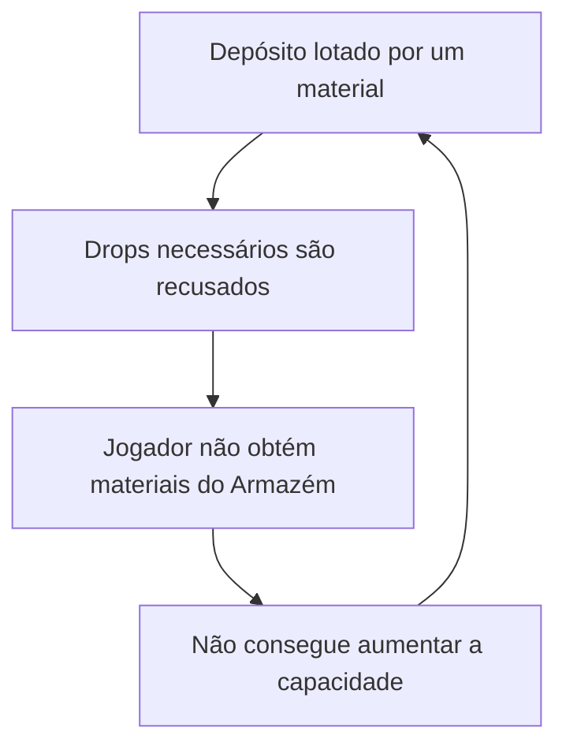
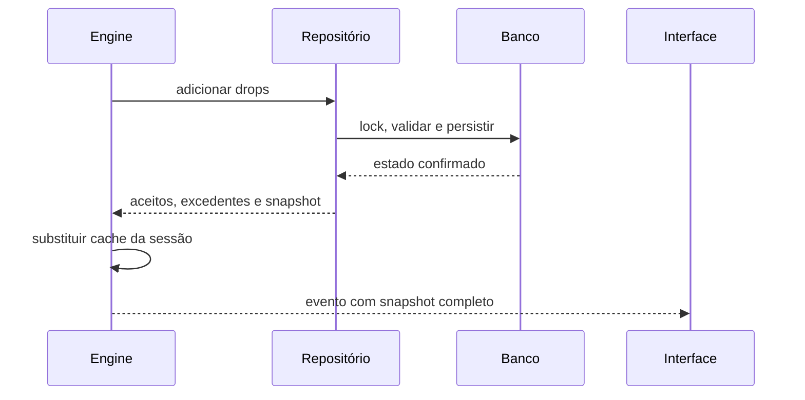

# Plano V2 — Ajustes Cirúrgicos do Acampamento, Recursos e Construções

## 1. Objetivo

Corrigir os problemas de sincronização e bloqueio de progressão do sistema de recursos sem reescrever o jogo inteiro, além de transformar o acampamento em um sistema sustentável para futuras adições de materiais, construções e receitas.

O plano foi refinado a partir do código atual do projeto, principalmente dos fluxos em:

- `backend/internal/db/camp.go`
- `backend/internal/db/resources.go`
- `backend/cmd/server/main.go`
- `backend/pkg/game/engine.go`
- `backend/pkg/game/building_registry.go`
- `backend/pkg/game/resource_registry.go`
- `frontend/src/hooks/useGameSocket.ts`
- `frontend/src/components/Camp/ResourceBar.tsx`
- `frontend/src/components/Dashboard/DashboardGrid.tsx`
- `frontend/src/components/Inventory/TibiaEquipmentGrid.tsx`

Este documento não propõe apagar saldos existentes nem substituir toda a arquitetura. A estratégia é criar uma única fonte autoritativa para o inventário de recursos, corrigir as mutações críticas e migrar a interface de forma compatível.

---

## 2. Diagnóstico confirmado no código

### 2.1 Por que aparece `Armazém: 209 / 200`

O backend usa `GetTotalResourceCount`, que soma indiscriminadamente todas as quantidades do mapa de recursos. Isso inclui troféus de chefes.

No exemplo da imagem:

| Item | Quantidade | Deve ocupar o armazém? |
|---|---:|---|
| Madeira | 9 | Sim |
| Pedra | 7 | Sim |
| Fibra | 184 | Sim |
| Troféu do Urso | 9 | Não |
| **Total exibido hoje** | **209** | Incorreto |
| **Uso material real** | **200** | Correto |

Há ainda uma divergência: o motor de combate tenta ignorar chaves com prefixo `trophy_`, mas o banco e o carregamento do acampamento contam os troféus. O mesmo saldo recebe interpretações diferentes em partes distintas do sistema.

### 2.2 Por que o valor só corrige após atualizar a página

Há mais de uma causa:

1. O motor altera `session.Resources` depois de um drop, mas não recalcula `session.Camp.StorageUsed`.
2. `SaveResourcesFunc` devolve apenas `error`, descartando as quantidades realmente aceitas, os excedentes e o snapshot salvo pelo banco.
3. `BUILDING_UPGRADE_STARTED` recarrega os recursos, porém a mensagem enviada diretamente ao socket não inclui `Resources`.
4. `SALVAGE_COMPLETED` também recarrega o estado, mas não envia a lista completa de recursos.
5. `resources` usa `omitempty`; quando a lista fica vazia, o campo desaparece do JSON e o frontend não consegue limpar o último recurso exibido.
6. Alguns eventos passam pelo broadcaster comum e outros são enviados diretamente, gerando contratos de estado diferentes.

Resultado: o frontend recebe partes do estado em momentos diferentes e só volta a ficar coerente quando faz uma carga completa.

### 2.3 Por que o jogador pode ficar travado

A capacidade base é 200. Um único recurso comum pode consumir todo esse espaço. O Armazém nível 1 exige madeira e pedra, mas o jogador da imagem está bloqueado por 184 fibras e não possui uma ação para descartar ou converter o excedente.

Isso cria um ciclo impossível:



Esse é um bloqueio de progressão, não apenas um problema visual.

### 2.4 Riscos adicionais encontrados

- O desmonte salva a remoção do equipamento antes de adicionar os recursos em outra operação. Se o depósito estiver cheio ou a segunda operação falhar, o item pode ser consumido sem entregar todo o rendimento.
- A coleta offline combina materiais e troféus, ignora erro/excedente da persistência e pode relatar um resultado diferente do efetivamente salvo.
- As mutações de recursos não possuem um lock único do inventário do personagem. Duas operações simultâneas podem calcular o mesmo espaço livre.
- `StartBuildingUpgrade` não valida de forma rígida se `slotKey` pertence ao tipo de construção solicitado.
- O campo `MaxStack` existe no catálogo, mas não é aplicado na persistência.
- `ReconcileCampUpgrades` consulta o banco a cada ciclo de aproximadamente 750 ms, inclusive quando não há construção terminando.
- `BuildDuration` é transportado como `time.Duration` em nanossegundos, obrigando o frontend a conhecer um detalhe interno de Go.
- A auditoria atual confere referências de conteúdo, mas não testa capacidade, custos alcançáveis, monotonicidade econômica ou possibilidade de deadlock.

---

## 3. Decisões de produto recomendadas

### 3.1 Regras de armazenamento

1. Materiais de construção ocupam o depósito.
2. Troféus de chefes não ocupam capacidade.
3. Materiais podem ser descartados mediante confirmação.
4. Troféus não podem ser descartados na primeira versão.
5. O backend é a única autoridade sobre quantidade, uso e capacidade.
6. Saldos legados acima do limite não serão apagados.
7. Enquanto estiver acima do limite, o jogador pode gastar ou descartar, mas novos materiais armazenáveis não são aceitos.
8. Um drop parcialmente aceito deve informar claramente o que entrou e o que foi perdido por falta de espaço.

### 3.2 Capacidade sugerida

| Estado | Capacidade atual | Capacidade V2 sugerida |
|---|---:|---:|
| Sem Armazém | 200 | **500** |
| Armazém nível 1 | 500 | **2.000** |
| Armazém nível 2 | 1.200 | **7.500** |
| Armazém nível 3 | 3.000 | **25.000** |

A elevação da base para 500 reduz o risco de bloqueio precoce, mas não substitui o descarte. O descarte é o mecanismo definitivo de recuperação.

### 3.3 Experiência de interface

- Retirar a barra permanente de recursos do centro do Dashboard.
- Adicionar o botão **Abrir Depósito de Recursos** imediatamente abaixo de **Abrir Mochila & Inventário**.
- Mostrar no botão um resumo pequeno, por exemplo `200 / 500` e um indicador de alerta.
- No modal, exibir somente recursos com quantidade maior que zero.
- O catálogo continua contendo todos os recursos; ele serve apenas para resolver nome, ícone, raridade, categoria e regras.
- O modal deve suportar busca, filtro, agrupamento e rolagem, pois o número de recursos crescerá.

---

## 4. Arquitetura alvo

### 4.1 Metadados explícitos no registro de recursos

Não utilizar `strings.HasPrefix(key, "trophy_")` como regra de negócio. Adicionar metadados ao registro:

```go
type ResourceCategory string

const (
    ResourceCategoryMaterial ResourceCategory = "material"
    ResourceCategoryTrophy   ResourceCategory = "trophy"
)

type ResourceDefinition struct {
    Key                 string
    Name                string
    Icon                string
    Rarity              string
    Description         string
    MaxStack            int64
    Category            ResourceCategory
    CountsTowardStorage bool
    Discardable         bool
}
```

Configuração esperada:

| Categoria | Ocupa espaço | Descartável |
|---|---|---|
| Material | Sim | Sim |
| Troféu | Não | Não |

Funções utilitárias:

```go
func GetStorageUsed(resources map[string]int64) int64
func IsResourceDiscardable(key string) bool
func ValidateResourceQuantity(key string, quantity int64) error
```

`GetTotalResourceCount` deve ser removida dos cálculos de capacidade. Pode ser mantida temporariamente apenas se algum relatório realmente precisar contar todos os itens.

### 4.2 Snapshot autoritativo

Criar um contrato único, enviado sempre depois de qualquer mutação:

```go
type ResourceInventorySnapshot struct {
    Items           []ResourceAmount `json:"items"`
    StorageUsed     int64            `json:"storage_used"`
    StorageCapacity int64            `json:"storage_capacity"`
    Revision        int64            `json:"revision"`
}
```

No WebSocket:

```go
type CombatMessage struct {
    // Campos existentes...
    ResourceInventory *ResourceInventorySnapshot `json:"resource_inventory,omitempty"`
}
```

O ponteiro permite diferenciar “nenhuma atualização nesta mensagem” de “inventário atualizado e vazio”. Um snapshot com `items: []` precisa permanecer no JSON para que o React elimine o último item da tela.

Durante uma janela de compatibilidade, os campos antigos `resources` e `camp.storage_used` podem continuar sendo enviados, mas o frontend novo deve consumir `resource_inventory`.

### 4.3 Resultado de mutação

Substituir funções que retornam somente `error` por um resultado completo:

```go
type ResourceMutationResult struct {
    Accepted  []ResourceAmount
    Overflow  []ResourceAmount
    Inventory ResourceInventorySnapshot
}

func AddCharacterResources(
    charID string,
    drops []ResourceAmount,
) (ResourceMutationResult, error)
```

O repositório deve calcular a capacidade. O motor não deve fornecer `maxCap` obtido de uma sessão potencialmente desatualizada.

Fluxo correto de drop:



O log deve mencionar apenas itens efetivamente aceitos e informar o excedente quando houver.

### 4.4 Concorrência e revisão

Toda mutação de recursos deve bloquear uma linha estável do personagem, preferencialmente `character_camps`, dentro da transação. Bloquear apenas linhas já existentes em `character_resources` não protege recursos ainda ausentes.

Aplicar `state_revision` ou uma revisão específica do inventário:

- incrementar em cada mutação confirmada;
- aceitar `expected_revision` em comandos destrutivos;
- retornar conflito amigável quando a tela estiver desatualizada;
- recarregar o snapshot no conflito.

### 4.5 Um único publicador de estado

Criar um helper no servidor para montar mensagens de estado. Nenhum handler de construção, descarte ou desmonte deve montar manualmente uma resposta parcial.

Eventos que obrigatoriamente carregam o snapshot completo:

- `WELCOME_EVENT`;
- `RESOURCE_DROP`;
- `RESOURCE_DISCARDED`;
- `BUILDING_UPGRADE_STARTED`;
- `BUILDING_UPGRADE_COMPLETED`;
- `SALVAGE_COMPLETED`;
- resultado de coleta offline;
- correção de conflito ou erro recuperável.

Também é necessário clonar o estado do acampamento e do inventário antes de colocá-lo no canal de envio, evitando que ponteiros sejam alterados enquanto a mensagem aguarda serialização.

---

## 5. Depósito de Recursos

### 5.1 Backend

Novo comando:

```json
{
  "type": "DISCARD_RESOURCE",
  "resource_key": "fiber",
  "quantity": 100,
  "expected_revision": 12
}
```

Validações:

1. personagem autenticado;
2. recurso existente no registro;
3. `Discardable == true`;
4. quantidade inteira e positiva;
5. quantidade disponível suficiente;
6. revisão compatível;
7. update transacional sem permitir saldo negativo.

Resposta:

```json
{
  "type": "RESOURCE_DISCARDED",
  "resource_inventory": {
    "items": [],
    "storage_used": 0,
    "storage_capacity": 500,
    "revision": 13
  }
}
```

Itens com quantidade zero podem permanecer no banco por compatibilidade, mas a consulta deve retornar somente quantidades positivas. Como limpeza opcional, a operação pode apagar a linha quando o saldo chegar a zero.

### 5.2 Frontend

Novos componentes sugeridos:

```text
frontend/src/components/Camp/
├── ResourceDepotButton.tsx
├── ResourceDepotModal.tsx
├── ResourceDepotCard.tsx
├── ResourceCapacityBar.tsx
└── ResourceDiscardDialog.tsx
```

Alterações:

- remover `ResourceBar` de `DashboardGrid.tsx`;
- inserir `ResourceDepotButton` em `TibiaEquipmentGrid.tsx`, abaixo do botão da mochila;
- controlar abertura do modal no componente pai ou em um hook dedicado;
- renderizar `resourceInventory.items.filter(item => item.quantity > 0)`;
- nunca percorrer o catálogo inteiro para criar cards com saldo zero;
- usar o catálogo somente para enriquecer os itens possuídos.

### 5.3 Conteúdo do modal

Cabeçalho:

- título **Depósito de Recursos**;
- barra `usado / capacidade`;
- percentual e estado visual;
- botão de fechar acessível.

Corpo:

- abas ou grupos **Materiais** e **Troféus**;
- busca por nome;
- filtros por raridade e categoria;
- grid responsivo com rolagem;
- cards com ícone, nome, raridade e quantidade;
- estado vazio: “Nenhum recurso coletado ainda”.

Alertas de capacidade:

| Uso | Estado |
|---:|---|
| 0–79% | Normal |
| 80–89% | Atenção |
| 90–99% | Alerta |
| 100% | Lotado, destacar descarte e Armazém |

Descarte:

- ação disponível apenas para materiais descartáveis;
- seletor de quantidade e botão “Máximo”;
- confirmação com nome e quantidade;
- desabilitar enquanto a requisição estiver pendente;
- exibir erro do servidor e aplicar o snapshot retornado;
- nunca fazer atualização otimista destrutiva.

---

## 6. Correção transacional do desmonte

O desmonte deve ser tudo ou nada.

### Fluxo recomendado

1. iniciar transação;
2. bloquear inventário, acampamento e recursos do personagem;
3. validar que o item ainda existe e pode ser desmontado;
4. calcular rendimento no servidor;
5. calcular se todo o rendimento armazenável cabe;
6. se não couber, rejeitar sem remover o item;
7. remover o item;
8. adicionar os recursos;
9. incrementar revisão;
10. commit;
11. retornar inventário de equipamentos e snapshot de recursos completos.

Na primeira versão, recomenda-se **desmonte integral ou rejeição integral**. Aceitar uma parte do rendimento cria uma experiência difícil de explicar e aumenta o risco de perda percebida.

Mensagem quando não houver espaço:

> Não há espaço para receber todos os materiais deste desmonte. Libere espaço no Depósito ou melhore o Armazém.

---

## 7. Correção da coleta offline

Materiais e troféus devem manter sua classificação no resultado.

O resultado precisa informar:

- materiais calculados;
- materiais aceitos;
- materiais excedentes;
- troféus aceitos;
- snapshot final;
- erro transacional, sem ignorá-lo.

Não utilizar atribuição silenciosa como `accRes, _, _`. Uma falha de persistência não pode ser apresentada ao jogador como recompensa salva.

---

## 8. Rebalanceamento das construções

### 8.1 Premissas

O ouro atual por monstro normal é aproximadamente `15–39`, e por chefe `80–199`, antes de bônus. Custos entre 100 e 2.000 de ouro e tempos de segundos/minutos tornam boa parte das construções trivial.

Os novos números devem ser calibrados por **tempo esperado de conquista**, e não apenas por valores absolutos:

| Nível | Meta de conquista |
|---|---|
| Construção nível 1 | 20–60 minutos de jogo ativo equivalente |
| Construção nível 2 | 4–12 horas acumuladas |
| Construção nível 3 | 2–5 dias de progressão |

Essas metas devem ser validadas por simulação usando ouro/hora e materiais/hora reais de cada faixa de expedição.

### 8.2 Tabela inicial V2 para simulação

Os valores abaixo são ponto de partida, não devem ser publicados sem rodar a auditoria econômica.

#### Armazém

| Nível | Ouro | Materiais | Tempo | Capacidade |
|---:|---:|---|---:|---:|
| 1 | 5.000 | 120 madeira, 80 pedra | 15 min | 2.000 |
| 2 | 30.000 | 500 madeira, 350 pedra, 250 ferro | 4 h | 7.500 |
| 3 | 150.000 | 1.800 madeira, 1.200 pedra, 1.000 ferro, 300 essência | 24 h | 25.000 |

#### Fogueira

| Nível | Ouro | Materiais | Tempo |
|---:|---:|---|---:|
| 1 | 3.000 | 100 madeira, 60 pedra | 10 min |
| 2 | 20.000 | 400 madeira, 250 pedra, 150 fibra | 2 h |
| 3 | 100.000 | 1.500 madeira, 900 pedra, 600 ferro + troféu | 18 h |

#### Fonte Arcana

| Nível | Ouro | Materiais | Tempo |
|---:|---:|---|---:|
| 1 | 5.000 | 120 pedra, 40 essência | 20 min |
| 2 | 30.000 | 500 pedra, 250 essência | 4 h |
| 3 | 150.000 | 1.500 pedra, 800 essência, 200 cristal | 24 h |

#### Cabana

| Nível | Ouro | Materiais | Tempo |
|---:|---:|---|---:|
| 1 | 4.000 | aproximadamente 250 materiais de tier inicial | 15 min |
| 2 | 25.000 | aproximadamente 1.300 materiais mistos | 3 h |
| 3 | 125.000 | aproximadamente 4.200 materiais avançados + troféu | 20 h |

#### Bancada de Desmontagem

| Nível | Ouro | Materiais | Tempo |
|---:|---:|---|---:|
| 1 | 8.000 | aproximadamente 400 materiais | 30 min |
| 2 | 40.000 | aproximadamente 1.450 materiais mistos | 6 h |
| 3 | 200.000 | aproximadamente 5.600 materiais avançados + troféu | 30 h |

### 8.3 Pré-requisitos

Adicionar ao registro:

```go
type BuildingRequirement struct {
    BuildingKey string `json:"building_key"`
    MinLevel    int    `json:"min_level"`
}

type BuildingLevelDefinition struct {
    // Campos existentes...
    RequiredBuildings []BuildingRequirement `json:"required_buildings,omitempty"`
}
```

Regras iniciais:

- níveis 2 das demais construções exigem Armazém nível 1;
- níveis 3 exigem Armazém nível 2;
- níveis avançados exigem troféus das expedições correspondentes;
- validar no servidor e mostrar os requisitos no modal.

### 8.4 Invariantes obrigatórias

O auditor econômico deve falhar o build se:

1. o custo armazenável do Armazém nível 1 superar a capacidade base;
2. o custo do Armazém nível 2 superar a capacidade do nível 1;
3. o custo do Armazém nível 3 superar a capacidade do nível 2;
4. custos não crescerem entre níveis;
5. capacidade não crescer entre níveis;
6. um recurso exigido não puder cair antes do conteúdo que usa a construção;
7. uma construção depender circularmente dela mesma;
8. o tempo estimado estiver fora da faixa de balanceamento configurada.

### 8.5 Valor percebido das construções

O código atual recupera o personagem no acampamento em poucos segundos. Se os custos forem multiplicados e o benefício continuar economizando apenas alguns segundos, a progressão ficará frustrante.

Antes do rebalanceamento final:

- medir tempo de recuperação após uma morte para personagens de níveis baixo, médio e alto;
- definir uma recuperação base razoável, por exemplo 45–90 segundos após derrota completa;
- fazer Fogueira, Fonte e Cabana reduzirem esse tempo progressivamente até uma faixa confortável de 15–30 segundos;
- mostrar no painel a estimativa “recuperação completa em Xs” e o ganho do próximo nível;
- manter o toggle de retorno automático à expedição, para que a espera continue compatível com o conceito idle.

Os números exatos devem sair da simulação, não de uma alteração isolada de constantes.

---

## 9. Validações cirúrgicas adicionais

### 9.1 Slots de construção

Em `StartBuildingUpgrade`, validar obrigatoriamente:

```go
expectedBuilding := game.SlotToBuildingMap[slotKey]
if expectedBuilding != buildingKey {
    return nil, ErrInvalidBuildingSlot
}
```

Não confiar no `building_key` enviado pelo cliente.

### 9.2 Fila de construção

Definir explicitamente a regra. Recomendação inicial: uma única construção ativa por personagem. Isso reforça a decisão estratégica e simplifica timers. Se construções paralelas forem desejadas, devem ser um benefício futuro de progressão, não um comportamento acidental.

### 9.3 Local permitido

- construir e desmontar: somente enquanto o personagem estiver no acampamento;
- consultar o Depósito: permitido em qualquer tela;
- descartar: preferencialmente somente no acampamento, caso se queira reforçar a fantasia; tecnicamente pode ser global.

### 9.4 Catálogo de transporte

Expor `build_duration_seconds` como número inteiro no DTO do catálogo. Não enviar nanossegundos de `time.Duration` ao TypeScript.

### 9.5 Reconciliação de timers

Não consultar o banco a cada 750 ms para personagens sem upgrade vencendo. Manter o próximo `upgrade_ends_at` em memória e reconciliar apenas quando o horário for atingido, ou usar um agendador por prazo.

---

## 10. Arquivos e alterações

### Backend — modificar

| Arquivo | Alteração |
|---|---|
| `backend/pkg/game/resource_registry.go` | Categoria, ocupação, descarte e validações do recurso |
| `backend/pkg/game/resources.go` | Snapshot e resultados de mutação |
| `backend/pkg/game/camp.go` | DTOs/revisões e requisitos de construção |
| `backend/pkg/game/building_registry.go` | Capacidades, custos, tempos e pré-requisitos V2 |
| `backend/internal/db/resources.go` | Lock autoritativo, cálculo de uso, add/discard e snapshot |
| `backend/internal/db/camp.go` | Uso correto, slot seguro, fila e custos transacionais |
| `backend/pkg/game/engine.go` | Remover pré-clamp/mutação otimista e aplicar resultado persistido |
| `backend/cmd/server/main.go` | Novos comandos, respostas completas e desmonte atômico |
| fluxo de coleta offline | Preservar aceitos/excedentes/troféus e tratar erros |

### Backend — criar

| Arquivo sugerido | Responsabilidade |
|---|---|
| `backend/internal/db/resource_inventory.go` | Operações transacionais e snapshots |
| `backend/internal/db/salvage.go` | Desmonte atômico |
| `backend/pkg/game/resource_inventory_test.go` | Regras de ocupação e categorias |
| `backend/internal/db/resource_inventory_test.go` | Persistência, concorrência e descarte |
| `backend/cmd/campeconomyaudit/main.go` | Simulação de progressão econômica |

### Frontend — modificar

| Arquivo | Alteração |
|---|---|
| `frontend/src/hooks/useGameSocket.ts` | Consumir snapshot e enviar descarte com revisão |
| `frontend/src/components/Dashboard/DashboardGrid.tsx` | Remover barra permanente de recursos |
| `frontend/src/components/Inventory/TibiaEquipmentGrid.tsx` | Inserir botão do Depósito abaixo da mochila |
| `frontend/src/components/Camp/BuildingUpgradeModal.tsx` | Custos, pré-requisitos, duração em segundos e benefício previsto |
| `frontend/src/components/Camp/SalvageModal.tsx` | Bloquear confirmação sem capacidade integral |
| `frontend/src/game/GameCatalog.ts` | Novos metadados e DTOs |

### Frontend — criar

- `ResourceDepotButton.tsx`
- `ResourceDepotModal.tsx`
- `ResourceDepotCard.tsx`
- `ResourceCapacityBar.tsx`
- `ResourceDiscardDialog.tsx`

---

## 11. Ordem de implementação

### P0 — Hotfix de integridade

1. Troféus deixam de ocupar capacidade em todas as rotas.
2. Capacidade base sobe para 500.
3. Criar snapshot autoritativo.
4. Drops passam a usar o resultado persistido, sem pré-mutação da sessão.
5. Incluir snapshot em boas-vindas, drops, construção e desmonte.
6. Permitir descarte seguro.
7. Preservar saldos legados e impedir perda automática.

**Critério de saída:** a imagem de exemplo passa de `209/200` para `200/500`, sem refresh, e o jogador consegue descartar fibras e voltar a coletar.

### P1 — Atomicidade e concorrência

1. Lock único por personagem.
2. Desmonte tudo-ou-nada.
3. Correção da coleta offline.
4. Revisão otimista.
5. Validação rígida de slot e local.

**Critério de saída:** nenhuma ação concorrente gera saldo negativo, ultrapassa capacidade indevidamente ou remove item sem entregar recursos.

### P2 — Depósito e UX

1. Remover `ResourceBar` do Dashboard.
2. Adicionar botão abaixo da mochila.
3. Criar modal escalável.
4. Ocultar recursos zerados.
5. Adicionar busca, filtros, alertas e descarte.

**Critério de saída:** adicionar 50 novos recursos ao catálogo não aumenta a tela principal nem cria 50 cards vazios.

### P3 — Economia de construção

1. Implementar tabela V2 provisória.
2. Adicionar pré-requisitos.
3. Criar auditor/simulador econômico.
4. Rodar cenários por faixa de expedição.
5. Ajustar custos, tempos, drops e benefícios.

**Critério de saída:** todas as construções são alcançáveis, progressivas e valiosas dentro das metas de tempo.

### P4 — Escalabilidade e acabamento

1. Otimizar reconciliação de timers.
2. Trocar duração em nanossegundos por segundos.
3. Aplicar ou remover `MaxStack` de forma consciente.
4. Atualizar documentação e changelog.
5. Instrumentar métricas de obtenção, overflow, descarte e upgrades.

---

## 12. Plano de testes

### 12.1 Unitários

- materiais contam para capacidade;
- troféus não contam;
- recurso inexistente é rejeitado;
- quantidade zero/negativa é rejeitada;
- descarte de troféu é rejeitado;
- descarte nunca produz saldo negativo;
- inventário vazio é serializado como `items: []`;
- custos/capacidades crescem por nível;
- dependências de construções não têm ciclos.

### 12.2 Integração com banco

- adicionar recurso abaixo, no limite e acima do limite;
- aceitar parcialmente drop quando aplicável;
- duas adições concorrentes disputando o último espaço;
- descartar enquanto um drop é salvo;
- iniciar construção e validar débito de ouro/recursos;
- falha no desmonte mantém o equipamento;
- sucesso no desmonte remove o equipamento e adiciona todo o rendimento;
- coleta offline persiste exatamente o resultado comunicado;
- saldo legado acima do limite permanece intacto.

### 12.3 WebSocket/frontend

- primeiro snapshot aparece sem aguardar tick adicional;
- drop atualiza quantidade e capacidade sem refresh;
- construção atualiza ouro e recursos sem refresh;
- descarte do último recurso remove o card imediatamente;
- fechamento/reabertura do modal mantém o snapshot correto;
- reconexão restaura o mesmo estado do banco;
- eventos fora de ordem são rejeitados por revisão inferior;
- recursos zerados não são renderizados.

### 12.4 Regressão de jogo

- combate continua a 60 FPS sem o modal aberto;
- drops de equipamentos não mudam;
- retorno automático à expedição continua funcional;
- bônus de acampamento continuam aplicados;
- upgrades em andamento sobrevivem a logout/restart;
- inventário e ouro permanecem consistentes.

---

## 13. Observabilidade recomendada

Registrar métricas agregadas:

- materiais gerados, aceitos e perdidos por overflow;
- percentual médio de ocupação;
- descartes por recurso;
- tempo até cada nível de construção;
- ouro consumido por construção;
- falhas e conflitos de revisão;
- tempo médio de recuperação no acampamento;
- taxa de uso do retorno automático.

Esses dados permitem ajustar a economia sem adivinhação e revelam materiais que saturam o depósito, como a fibra no exemplo atual.

---

## 14. Critérios de aceite finais

1. Troféus nunca alteram `storage_used`.
2. Toda mutação relevante atualiza a interface sem refresh.
3. O servidor envia uma fotografia coerente de itens, uso, capacidade e revisão.
4. O jogador nunca fica permanentemente bloqueado por depósito cheio.
5. Nenhum item é perdido em desmonte recusado ou falho.
6. O Depósito exibe somente recursos possuídos.
7. Novos recursos podem ser adicionados ao catálogo sem alterar a tela principal.
8. Custos de construção são alcançáveis, crescentes e auditados por tempo de conquista.
9. Nenhuma construção pode ser instalada no slot errado.
10. Testes de concorrência, offline, descarte e vazio passam no CI.

---

## 15. Recomendação de execução

Aplicar primeiro P0 e P1 em um branch curto, sem misturar o rebalanceamento econômico. Depois de estabilizar persistência e sincronização, implementar o Depósito. Só então publicar novos custos, pois o sistema econômico não deve ser endurecido enquanto ainda existe risco de bloquear ou perder recursos.

Esta divisão mantém o trabalho cirúrgico: primeiro corrigir a verdade do estado; depois corrigir a experiência; por último, calibrar a progressão.