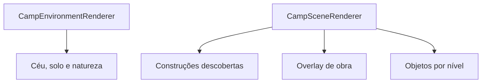
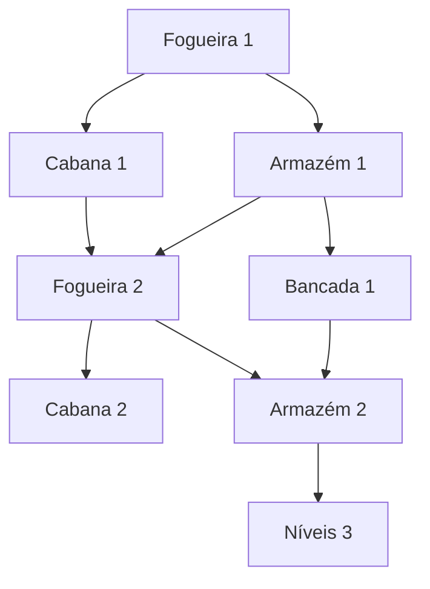

# Plano V3 — Refatoração Visual do Acampamento, Manuais, Progressão de Obras e Desmontagem

## 1. Objetivo

Transformar o acampamento atual em uma área de progressão visual e funcional, removendo elementos redundantes e fazendo cada melhoria ser percebida tanto no Canvas quanto na jogabilidade.

O escopo inclui:

- eliminar a casa e a fogueira legadas duplicadas no cenário;
- redimensionar a Cabana usando a antiga casa como referência;
- criar diferenças visuais fortes entre os níveis de todas as construções;
- mostrar obra em andamento com andaime, poeira, progresso e martelo animado;
- manter uma obra simultânea no início e permitir evolução limitada dessa capacidade;
- aumentar custos, tempos, troféus e dependências entre construções;
- esconder construções ainda não descobertas;
- introduzir Manuais de Construção como drops de chefes/masmorras;
- permitir desmonte arriscado e em lote;
- corrigir a atomicidade real do desmonte antes de adicionar perda intencional de itens.

O plano foi elaborado a partir do código contido em `repomix-output(6).xml` e da captura atual do acampamento.

---

## 2. Diagnóstico confirmado

### 2.1 A casa está duplicada

`getCampBackground()` desenha uma cabana fixa de aproximadamente 110 × 60 px à direita, além de suporte de armas, barril, banco e uma fogueira estática.

Depois, `GameViewport` desenha o mesmo background e chama `campSceneRenderer.render()`, que adiciona:

- a Cabana modular no slot oeste;
- o Armazém no slot leste;
- a Fogueira modular no centro;
- Fonte e Bancada.

Isso cria duas casas e duas representações da fogueira. A casa legada parece maior e mais importante do que a construção que realmente possui nível e efeito.

### 2.2 A Cabana modular é pequena

O renderer atual usa aproximadamente:

- nível 1: tenda com 40 px de largura;
- nível 2: casa com 56 px de largura;
- nível 3: chalé com 68 px de largura.

A casa legada possui cerca de 130 px contando o telhado. Portanto, mesmo no nível máximo, a construção modular parece um objeto decorativo.

### 2.3 Os slots declaram tamanho, mas o renderer não usa

`CampLayoutRegistry.ts` declara `width` e `height`, e `BuildingRenderContext` possui `scale?`, mas:

- `CampSceneRenderer` não calcula nem envia `scale`;
- os renderers desenham com medidas absolutas;
- `width` e `height` não controlam o footprint real;
- aumentar uma construção pode causar sobreposição sem validação.

### 2.4 A obra já é detectada, mas substitui o prédio

Todos os renderers verificam `isUnderConstruction` no início e retornam depois de desenhar apenas andaime e barra. Ao melhorar uma construção existente, o prédio atual desaparece durante a obra.

O correto é:

1. desenhar o nível atual;
2. desenhar sobre ele um overlay de construção;
3. indicar o nível alvo;
4. manter a evolução visual até a conclusão.

### 2.5 A fila única já existe no backend

`StartBuildingUpgrade` conta qualquer melhoria ativa do personagem e impede uma segunda. Essa regra está correta para o início da progressão, mas hoje não é apresentada como capacidade evolutiva.

### 2.6 Não existe descoberta de construções

- `EnsureCharacterCamp` cria linhas de nível zero para todas as cinco construções.
- O catálogo envia todas as definições.
- `CampPanel` executa `buildingDefinitions.map(...)` e mostra tudo.
- Não há tabela de projetos descobertos, manual de construção ou limite de nível conhecido.

### 2.7 O desmonte ainda não é totalmente atômico

Apesar do nome `SalvageItemAtomically` e da transação serializável, a função chama:

- `GetCharacterInventory`, que usa o `DB` global;
- `SaveCharacterInventory`, que também usa o `DB` global.

Essas operações não utilizam o `tx` aberto. Portanto, a remoção do item pode ser confirmada fora da transação antes de uma falha no crédito de recursos.

Adicionar chance proposital de perder item antes de corrigir isso tornaria impossível distinguir uma falha de gameplay de uma falha de persistência.

---

## 3. Arquitetura visual proposta

### 3.1 Separar ambiente de construções

O background do acampamento deve conter apenas elementos permanentes:

- céu, lua, estrelas e nuvens;
- montanhas e árvores distantes;
- chão, caminhos, pedras e vegetação;
- iluminação ambiente.

Devem sair de `getCampBackground()`:

- casa/cabana fixa;
- fogueira fixa e seu glow;
- suporte de armas ligado à moradia;
- barris que representem o Armazém;
- objetos que indiquem construções ainda não descobertas.

Esses objetos passam a pertencer aos renderers modulares.



### 3.2 Novo contrato de layout

Substituir tamanhos decorativos por footprints reais:

```ts
export interface CampBuildingSlotConfig {
  slotKey: string;
  buildingKey: string;
  anchorX: number;
  groundY: number;
  maxWidth: number;
  maxHeight: number;
  sortY: number;
  baseScale: number;
}

export interface BuildingRenderContext {
  level: number;
  targetLevel?: number;
  discovered: boolean;
  isUnderConstruction: boolean;
  constructionProgress: number;
  x: number;
  y: number;
  scale: number;
  time: number;
}
```

Cada renderer desenha com origem no centro inferior da construção. Assim todos os níveis permanecem apoiados no mesmo ponto do chão.

### 3.3 Layout sugerido para 500 × 260

| Construção | Posição | Papel visual |
|---|---|---|
| Cabana | fundo esquerdo, `x≈75`, `groundY≈196` | maior construção residencial |
| Fonte | fundo central-direito, `x≈315`, `groundY≈177` | estrutura vertical e luminosa |
| Armazém | fundo direito, `x≈420`, `groundY≈202` | segunda maior construção |
| Fogueira | centro, `x≈235`, `groundY≈213` | ponto focal do acampamento |
| Bancada | frente direita, `x≈340`, `groundY≈226` | ferramenta/forja de primeiro plano |

O personagem permanece entre Cabana e Fogueira. As maiores construções ficam no fundo para não cobrir o herói.

### 3.4 Tamanho visual da Cabana

| Nível | Silhueta | Dimensão aproximada |
|---:|---|---:|
| 0 | saco de dormir e estacas | 30 × 12 px |
| 1 | tenda reforçada | 58 × 42 px |
| 2 | cabana de madeira, usando a casa antiga como referência | **110 × 76 px** |
| 3 | chalé com ala lateral, varanda e chaminé | **140 × 96 px** |

A casa antiga deixa de existir no background. O visual equivalente passa a ser conquistado ao chegar à Cabana nível 2.

---

## 4. Evolução visual por nível

### 4.1 Fogueira

| Nível | Aparência |
|---:|---|
| 0 | cinzas, dois troncos queimados e círculo marcado no solo |
| 1 | chama pequena, seis pedras irregulares e dois troncos cruzados |
| 2 | chama maior, anel completo de pedras, tripé com panela, banco e mais fagulhas |
| 3 | grande fogueira cerimonial, pedras talhadas, cauldron, estandarte, iluminação extensa e fumaça forte |

Além de aumentar `flameHeight` e `glowRadius`, cada nível precisa adicionar elementos novos. Apenas aumentar números não produz sensação suficiente de evolução.

### 4.2 Fonte Arcana

| Nível | Aparência |
|---:|---|
| 0 | solo úmido com brilho quase apagado |
| 1 | pequena nascente azul e pedras naturais |
| 2 | poço de pedra com duas colunas rúnicas e água circulando |
| 3 | fonte arcana elevada, obeliscos, runas, partículas e feixe de mana |

### 4.3 Cabana do Aventureiro

| Nível | Aparência |
|---:|---|
| 0 | saco de dormir, mochila e estacas |
| 1 | tenda grande com cordas, lampião e baú pequeno |
| 2 | casa de madeira no tamanho da construção legada, janela acesa e varanda |
| 3 | chalé de dois volumes, fundação de pedra, chaminé, varanda maior e bandeira do personagem |

O banco de tronco e o suporte de armas podem surgir como anexos da Cabana nos níveis 2 e 3.

### 4.4 Armazém

| Nível | Aparência |
|---:|---|
| 0 | lona cobrindo duas caixas |
| 1 | galpão pequeno, caixas e barris |
| 2 | depósito reforçado com portão, prateleiras e pilhas de recursos |
| 3 | armazém de dois pavimentos, guincho, telhado reforçado e brasão |

A quantidade de caixas visíveis pode reagir ao percentual de ocupação, sem representar cada recurso individual.

### 4.5 Bancada de Desmontagem

| Nível | Aparência |
|---:|---|
| 0 | mesa quebrada e ferramentas enferrujadas |
| 1 | bancada funcional, martelo e caixa de ferramentas |
| 2 | bigorna, pequena forja e ferramentas organizadas |
| 3 | oficina completa, forno, roda de afiar, faíscas e braço mecânico |

---

## 5. Overlay compartilhado de construção

Criar:

```text
frontend/src/game/camp/renderers/ConstructionOverlayRenderer.ts
```

Responsabilidades:

- desenhar andaime proporcional ao footprint;
- manter o prédio do nível atual visível;
- desenhar partes incompletas do nível alvo;
- mostrar poeira e pequenas lascas;
- mostrar barra de progresso;
- desenhar martelo pixel art animado;
- exibir `Nv. atual → Nv. alvo`.

### Martelo animado

Não usar emoji dentro do Canvas, porque a aparência varia por sistema operacional. Desenhar cabo e cabeça com retângulos pixelados.

```ts
const swing = Math.sin(time / 120);
ctx.save();
ctx.translate(footprintRight - 10, footprintTop + 8);
ctx.rotate(-0.65 + swing * 0.35);
drawPixelHammer(ctx);
ctx.restore();
```

O martelo deve aparecer somente na construção que realmente está em obra.

### Alteração nos renderers

Remover os blocos que fazem `return` antecipado em cada renderer. O fluxo passa a ser:

```ts
renderer.drawLevel(currentLevel);

if (isUnderConstruction) {
  constructionOverlayRenderer.render({
    currentLevel,
    targetLevel,
    progress,
    footprint,
  });
}
```

Usar animações derivadas de `time`; não criar `Math.random()` a cada frame.

---

## 6. Progressão da capacidade de construção

### 6.1 Estado inicial

- uma equipe de obras;
- uma construção ativa;
- nenhuma fila automática;
- painel mostra `Equipes de obra: 1/1`.

### 6.2 Evolução sugerida

| Desbloqueio | Requisitos | Benefício |
|---|---|---|
| Planejamento de Obras | Cabana Nv. 2 | 1 obra ativa + 1 projeto aguardando |
| Ferramentas Profissionais | Bancada Nv. 2 | −10% no tempo de construção |
| Manual do Mestre de Obras | drop do boss do Planalto ou masmorra | habilita progressão da segunda equipe |
| Segunda Equipe | Cabana Nv. 3 + Bancada Nv. 2 + Manual | até 2 obras simultâneas |
| Oficina de Engenharia | Bancada Nv. 3 + Armazém Nv. 3 | −25% de tempo e fila de 2 projetos |

Recomendação: nunca ultrapassar duas obras simultâneas. Mais que isso reduz o valor dos timers e dos requisitos.

### 6.3 Efeitos declarativos

Adicionar efeitos ao registro:

```go
{Key: "construction_active_slots", Value: 1}
{Key: "construction_queue_slots", Value: 1}
{Key: "construction_speed_percent", Value: 10}
```

O backend calcula `CampConstructionBonuses`; o frontend apenas apresenta o snapshot.

### 6.4 Fila futura

Uma fila real precisa de tabela própria:

```sql
CREATE TABLE character_camp_construction_queue (
    id UUID PRIMARY KEY,
    character_id UUID NOT NULL,
    building_key VARCHAR(80) NOT NULL,
    target_level INT NOT NULL,
    status VARCHAR(20) NOT NULL,
    queued_at TIMESTAMPTZ NOT NULL,
    started_at TIMESTAMPTZ,
    ends_at TIMESTAMPTZ,
    cost_snapshot JSONB NOT NULL,
    request_id UUID NOT NULL UNIQUE
);
```

Ouro e materiais devem ser reservados quando o projeto entra na fila. Isso evita que o projeto tente iniciar horas depois sem recursos.

Implementar a fila depois de estabilizar manuais e custos. A primeira entrega pode manter somente uma obra ativa e apresentar o futuro desbloqueio no painel.

---

## 7. Sistema de Manuais de Construção

### 7.1 Modelo de descoberta

Criar uma tabela explícita:

```sql
CREATE TABLE character_building_blueprints (
    character_id UUID NOT NULL,
    building_key VARCHAR(80) NOT NULL,
    unlocked_max_level INT NOT NULL DEFAULT 1,
    source_key VARCHAR(120),
    discovered_at TIMESTAMPTZ NOT NULL DEFAULT NOW(),
    PRIMARY KEY (character_id, building_key)
);
```

`unlocked_max_level` permite:

- manual comum liberar a construção e o nível 1;
- evolução natural liberar o nível 2;
- um Projeto Magistral liberar o nível 3, caso essa profundidade seja adotada.

### 7.2 Estado do acampamento

```go
type BuildingBlueprintProgress struct {
    BuildingKey     string    `json:"building_key"`
    UnlockedMaxLevel int      `json:"unlocked_max_level"`
    DiscoveredAt    time.Time `json:"discovered_at"`
}

type CampState struct {
    // campos atuais
    Blueprints map[string]BuildingBlueprintProgress `json:"blueprints"`
}
```

### 7.3 Exibição

`CampPanel` deve filtrar:

```ts
const discoveredDefinitions = buildingDefinitions.filter(
  definition => camp?.blueprints?.[definition.key]
);
```

- construção desconhecida não aparece no painel;
- nome, custo e função não são revelados;
- no Canvas, o slot permanece como terreno natural vazio;
- ao estudar um manual, tocar animação de projeto aberto e mostrar a nova construção.

### 7.4 Tipo de item

Não classificar Manual de Construção como `skill_book`. Introduzir um tipo canônico:

```go
type ItemKind string

const (
    ItemKindEquipment          ItemKind = "equipment"
    ItemKindSkillBook          ItemKind = "skill_book"
    ItemKindConstructionManual ItemKind = "construction_manual"
    ItemKindQuest              ItemKind = "quest"
)
```

Campos adicionais:

```go
ItemKind          ItemKind `json:"item_kind"`
UnlockBuildingKey string   `json:"unlock_building_key,omitempty"`
UnlockMaxLevel    int      `json:"unlock_max_level,omitempty"`
```

Nova ação:

```json
{
  "action": "LEARN_BUILDING_BLUEPRINT",
  "item_id": "manual_..."
}
```

O servidor deve, em uma única transação:

1. bloquear o inventário;
2. validar o manual;
3. remover uma unidade;
4. inserir/atualizar o blueprint;
5. incrementar a revisão do acampamento;
6. devolver inventário e acampamento completos.

### 7.5 Fontes sugeridas

Os manuais críticos não devem depender somente de sorte.

| Manual | Fonte principal | Regra recomendada |
|---|---|---|
| Fogueira do Acampamento | conhecimento inicial | liberada para todos |
| Armazém de Recursos | Urso Ranzinza | garantido na primeira vitória |
| Cabana do Aventureiro | Fiona Arrazadora | garantido na primeira vitória |
| Fonte Arcana | Alma Negra | garantido na primeira vitória |
| Bancada de Desmontagem | Esquelético Pacato | garantido na primeira vitória |
| Manual do Mestre de Obras | boss do Planalto ou masmorra temática | chance + proteção contra azar |

Projetos Magistrais de nível 3 podem ter 8%–12% de chance, com garantia após 10–15 vitórias sem drop. Isso preserva raridade sem bloquear indefinidamente o jogador.

### 7.6 Manuais repetidos

Depois de aprendido:

- impedir o drop de manuais básicos repetidos; ou
- converter duplicata em `Fragmentos de Projeto`;
- nunca deixar manual aprendido sem utilidade ocupando a mochila.

Recomendação: conversão automática em Fragmentos de Projeto, usados em projetos avançados.

### 7.7 Migração

- construções já edificadas devem ser automaticamente descobertas;
- Fogueira deve ser descoberta por todos;
- não apagar níveis ou timers existentes;
- construções nível zero ainda não utilizadas podem ficar ocultas até o manual;
- disponibilizar um comando administrativo de desenvolvimento para liberar/revogar blueprints durante os testes.

---

## 8. Dificuldade, troféus e dependências

### 8.1 Situação atual

Os custos atuais variam de 100 a 2.000 de ouro e os tempos de 10 segundos a 25 minutos. Apenas duas melhorias usam troféu e exigem somente uma unidade.

Como cada boss já entrega exatamente um troféu garantido, a quantidade exigida pode representar diretamente o número de expedições concluídas.

### 8.2 Tabela inicial para balanceamento

Estes números são uma base de simulação. Devem ser validados contra ouro/hora, recursos/hora e duração média de uma expedição.

#### Fogueira

| Nível | Ouro | Materiais | Troféus | Tempo | Dependências |
|---:|---:|---|---|---:|---|
| 1 | 3.000 | 80 madeira, 40 pedra | — | 10 min | descoberta inicial |
| 2 | 20.000 | 400 madeira, 250 pedra, 150 fibra | 5 Garras do Urso | 2 h | Armazém 1, Cabana 1 |
| 3 | 100.000 | 1.500 madeira, 900 pedra, 600 ferro, 200 essência | **12 Crânios do Esquelético** | 18 h | Armazém 2, Cabana 2 |

#### Armazém

| Nível | Ouro | Materiais | Troféus | Tempo | Dependências |
|---:|---:|---|---|---:|---|
| 1 | 5.000 | 120 madeira, 80 pedra | — | 15 min | Manual, Fogueira 1 |
| 2 | 35.000 | 500 madeira, 350 pedra, 250 ferro | 8 Lâminas do Destruidor | 4 h | Fogueira 2, Cabana 1, Bancada 1 |
| 3 | 180.000 | 1.800 madeira, 1.200 pedra, 1.000 ferro, 300 essência | **15 Martelos da Lei** | 24 h | Fogueira 3, Cabana 2, Bancada 2 |

#### Cabana

| Nível | Ouro | Materiais | Troféus | Tempo | Dependências |
|---:|---:|---|---|---:|---|
| 1 | 4.000 | 160 madeira, 100 fibra | — | 15 min | Manual, Fogueira 1 |
| 2 | 25.000 | 600 madeira, 350 fibra, 250 pedra | 8 Tiaras da Fiona | 3 h | Armazém 1, Fogueira 2 |
| 3 | 130.000 | 2.200 madeira, 1.200 fibra, 900 ferro | **15 Martelos da Lei** | 20 h | Armazém 2, Fogueira 3, Fonte 2 |

#### Fonte Arcana

| Nível | Ouro | Materiais | Troféus | Tempo | Dependências |
|---:|---:|---|---|---:|---|
| 1 | 5.000 | 120 pedra, 40 essência | — | 20 min | Manual, Fogueira 1 |
| 2 | 30.000 | 500 pedra, 250 essência, 150 fibra | 8 Brasões da Alma Negra | 4 h | Armazém 2, Fogueira 2 |
| 3 | 160.000 | 1.500 pedra, 800 essência, 200 cristais glaciais | **15 Coroas do Santuário** | 24 h | Armazém 3, Fogueira 3, Cabana 3 |

#### Bancada de Desmontagem

| Nível | Ouro | Materiais | Troféus | Tempo | Dependências |
|---:|---:|---|---|---:|---|
| 1 | 8.000 | 180 madeira, 100 pedra, 80 ferro | — | 30 min | Manual, Armazém 1 |
| 2 | 45.000 | 600 madeira, 400 pedra, 350 ferro, 100 fibra | 8 Brasões da Alma Negra | 6 h | Armazém 2, Cabana 1 |
| 3 | 220.000 | 2.300 madeira, 1.400 pedra, 1.200 ferro, 500 essência, 200 cristais | **18 Varinhas das Trevas** | 30 h | Armazém 3, Cabana 3 |

### 8.3 Grafo de progressão

O grafo deve ser acíclico. Uma rota possível:



### 8.4 Invariantes econômicas

O auditor deve garantir:

- custo armazenável do Armazém 1 ≤ capacidade base de 500;
- custo do Armazém 2 ≤ capacidade do Armazém 1;
- custo do Armazém 3 ≤ capacidade do Armazém 2;
- nenhuma dependência circular;
- manual disponível antes da construção ser necessária;
- troféu disponível antes do nível que o exige;
- custos e durações crescentes;
- nenhum requisito depender de uma região ainda inalcançável;
- tempo estimado compatível com a recompensa.

---

## 9. Bancada com risco e multisseleção

### 9.1 Primeiro corrigir a transação

Criar funções que usem o mesmo `*sql.Tx`:

```go
func GetCharacterInventoryTx(tx *sql.Tx, charID string, forUpdate bool) (*Inventory, error)
func SaveCharacterInventoryTx(tx *sql.Tx, charID string, inv *Inventory) error
```

Todo o fluxo de desmonte deve ficar dentro da mesma transação:

1. lock do inventário;
2. lock do acampamento/recursos;
3. validação dos itens;
4. cálculo e rolagem;
5. remoção dos itens;
6. crédito dos sucessos;
7. gravação dos resultados;
8. incremento de revisão;
9. commit.

Se ocorrer falha técnica, nenhum item é perdido. Se a rolagem de gameplay falhar e a transação confirmar, o item é consumido sem rendimento.

### 9.2 Progressão sugerida da Bancada

| Nível | Chance base de sucesso | Lote máximo | Rendimento | Benefício adicional |
|---:|---:|---:|---:|---|
| 1 | 65% | 5 itens | normal | desmonte básico |
| 2 | 80% | 15 itens | +15% | filtros e seleção em lote |
| 3 | 92% | 50 itens | +30% | modo seguro usando catalisador |

A chance exata deve aparecer antes da confirmação.

Modificadores opcionais por raridade:

| Raridade | Ajuste |
|---|---:|
| Comum | +5% |
| Incomum | +3% |
| Raro | 0% |
| Épico | −4% |
| Lendário ou superior | −8% |

Aplicar limite entre 50% e 97%. Itens valiosos podem usar o **Modo Seguro**, que consome ouro ou `Kit de Ferramentas de Precisão` e garante 100% no nível 3.

### 9.3 Contratos

Preview em lote:

```json
{
  "action": "SALVAGE_BATCH_PREVIEW",
  "item_ids": ["item-1", "item-2"],
  "request_id": "uuid"
}
```

Confirmação:

```json
{
  "action": "SALVAGE_BATCH",
  "item_ids": ["item-1", "item-2"],
  "request_id": "uuid",
  "expected_revision": 42,
  "safe_mode": false
}
```

Resultado:

```go
type SalvageItemOutcome struct {
    ItemID        string           `json:"item_id"`
    ItemName      string           `json:"item_name"`
    Success       bool             `json:"success"`
    SuccessChance float64          `json:"success_chance"`
    Yield         []ResourceAmount `json:"yield,omitempty"`
}

type SalvageBatchResult struct {
    RequestID  string                    `json:"request_id"`
    Outcomes   []SalvageItemOutcome      `json:"outcomes"`
    TotalYield []ResourceAmount          `json:"total_yield"`
    Inventory  InventoryData             `json:"inventory"`
    Resources  ResourceInventorySnapshot `json:"resource_inventory"`
}
```

`request_id` precisa ser idempotente: repetir a mesma requisição não pode rolar novamente nem consumir os itens duas vezes.

### 9.4 Capacidade do Depósito

Antes de rolar, reservar espaço para o rendimento máximo possível de todos os itens selecionados. Se não houver espaço, rejeitar o lote sem consumir nada.

Isso é mais previsível do que rolar primeiro e depender das falhas para o lote caber.

### 9.5 Interface do lote

O modal deve oferecer:

- checkbox em cada equipamento;
- seleção de todos os itens visíveis;
- filtros por raridade, slot e tier;
- botão “Selecionar apenas Comuns/Incomuns”;
- resumo de quantidade, chance média e rendimento máximo;
- alerta explícito de que itens podem ser destruídos sem retorno;
- confirmação reforçada para Raro ou superior;
- exclusão automática de equipado, favorito, bloqueado, livro, manual e item de missão;
- tela final separando sucessos e falhas.

Não atualizar a mochila de forma otimista. Aplicar somente o snapshot confirmado pelo servidor.

### 9.6 Testabilidade do RNG

Não chamar gerador global diretamente na regra. Injetar uma interface:

```go
type RollSource interface {
    Float64() float64
}
```

Produção usa fonte segura/isolada; testes usam sequência determinística.

---

## 10. Alterações por arquivo

### Frontend — modificar

| Arquivo | Alteração |
|---|---|
| `frontend/src/game/renderers/biomes/BiomeRenderers.ts` | remover casa, fogueira e props redundantes do background |
| `frontend/src/game/camp/CampLayoutRegistry.ts` | anchors, footprints, escala e novo layout |
| `frontend/src/game/camp/types.ts` | targetLevel, discovered, footprint e escala obrigatória |
| `frontend/src/game/camp/CampSceneRenderer.ts` | filtrar descobertas, manter nível atual e aplicar overlay |
| `frontend/src/game/camp/renderers/*.ts` | silhuetas progressivas e novos tamanhos |
| `frontend/src/components/Camp/CampPanel.tsx` | filtrar blueprints e mostrar capacidade das equipes |
| `frontend/src/components/Camp/BuildingCard.tsx` | descoberta, projeto magistral e estado de fila |
| `frontend/src/components/Camp/BuildingUpgradeModal.tsx` | manuais, troféus maiores, dependências e equipe disponível |
| `frontend/src/components/Camp/SalvageModal.tsx` | multisseleção, risco, filtros, resumo e resultados |
| `frontend/src/hooks/useGameSocket.ts` | ações/eventos de blueprint, fila e batch salvage |

### Frontend — criar

- `ConstructionOverlayRenderer.ts`
- `PixelHammerRenderer.ts`
- `CampConstructionStatus.tsx`
- `BlueprintLearnedModal.tsx`
- `SalvageBatchResultModal.tsx`

### Backend — modificar

| Arquivo | Alteração |
|---|---|
| `backend/pkg/game/camp.go` | blueprints, capacidade de obra e estado da fila |
| `backend/pkg/game/building_registry.go` | novos custos, troféus, requisitos e efeitos |
| `backend/pkg/game/loot.go` | templates dos manuais |
| `backend/pkg/game/resource_profiles.go` | fontes de manuais e projetos magistrais |
| `backend/pkg/game/salvage.go` | chance, resultado por item e RNG injetável |
| `backend/internal/db/camp.go` | persistência de blueprint e limite evolutivo de obras |
| `backend/internal/db/resources.go` | snapshot após lote |
| `backend/cmd/server/main.go` | novos comandos e eventos WebSocket |

### Backend — criar

- `backend/internal/db/blueprints.go`
- `backend/internal/db/salvage_batch.go`
- migration para `character_building_blueprints`
- migration futura para fila de obras
- testes de blueprint, dependência, RNG, lote, idempotência e transação

---

## 11. Ordem de implementação

### P0 — Correção visual imediata

1. Remover casa e fogueira legadas do background.
2. Aumentar Cabana nível 2 para o tamanho da antiga casa.
3. Aumentar Cabana nível 3 e revisar layout.
4. Diferenciar visualmente todos os níveis.
5. Criar overlay compartilhado com martelo.
6. Manter construção atual visível durante upgrade.

### P1 — Descoberta por manuais

1. Criar tabela de blueprints.
2. Adicionar tipo canônico de manual.
3. Implementar estudo transacional.
4. Filtrar painel e Canvas.
5. Adicionar drops garantidos de primeiro abate.
6. Migrar personagens sem perder construções existentes.

### P2 — Economia e dependências

1. Aplicar tabela provisória.
2. Validar grafo sem ciclos.
3. Aumentar troféus.
4. Rodar auditor econômico.
5. Ajustar custos pela telemetria/simulação.

### P3 — Desmonte seguro tecnicamente e arriscado no gameplay

1. Corrigir acesso ao inventário dentro do `tx`.
2. Adicionar RNG testável.
3. Implementar preview em lote.
4. Implementar resultado por item e idempotência.
5. Criar multisseleção no modal.
6. Adicionar Modo Seguro no nível 3.

### P4 — Evolução das equipes de obra

1. Expor capacidade atual no painel.
2. Aplicar bônus de velocidade.
3. Implementar segunda equipe, máximo de duas.
4. Implementar fila reservada somente depois.

---

## 12. Testes e critérios de aceite

### Visual

- não existe casa fixa no background;
- não existe fogueira estática atrás da modular;
- Cabana nível 2 possui presença semelhante à antiga casa;
- níveis 1, 2 e 3 são reconhecíveis sem texto;
- o personagem não fica coberto por Cabana/Armazém;
- obra mantém o nível atual visível;
- martelo aparece somente na construção ativa;
- animações não criam objetos aleatórios ilimitados por frame.

### Manuais

- novo personagem vê apenas Fogueira;
- primeira vitória configurada entrega o manual crítico;
- estudar manual remove item e revela construção no mesmo snapshot;
- repetição da requisição não consome outro item;
- manual não pode ser desmontado;
- construção existente continua descoberta após migração;
- construção desconhecida não aparece no painel.

### Construções

- apenas uma obra é aceita no início;
- pré-requisitos são validados no backend;
- nenhum ciclo existe no grafo;
- troféus são debitados corretamente;
- custo de Armazém é possível dentro da capacidade anterior;
- segunda equipe só funciona após todos os requisitos;
- duas requisições simultâneas não excedem a quantidade de equipes.

### Desmonte

- falha técnica nunca remove item;
- falha de gameplay confirmada remove item e rende zero;
- sucesso remove item e credita recursos;
- lote aplica uma rolagem por item;
- repetição do mesmo `request_id` devolve o mesmo resultado;
- lote sem espaço é rejeitado antes de consumir itens;
- itens protegidos não entram no lote;
- snapshots de mochila e recursos atualizam sem refresh.

### Validação final

```bash
go test ./...
go vet ./...
npm run build
node tools/audit-camp-content.mjs
```

Estender o auditor para verificar:

- blueprints e fontes de drop;
- dependências cíclicas;
- custos versus capacidade;
- quantidades positivas de troféus;
- renderer para cada construção;
- footprint dentro do Canvas;
- efeitos de equipe reconhecidos pelo calculador.

---

## 13. Prompt cirúrgico para a IDE

```text
Refatore incrementalmente o sistema de acampamento do Project Atlas com base no plano V3. Não reescreva combate, autenticação ou inventário fora do necessário.

Primeiro confirme no código real:
- getCampBackground desenha casa e fogueira fixas;
- CampSceneRenderer desenha novamente as construções modulares;
- HutRenderer usa largura muito inferior à casa legada;
- os renderers retornam cedo durante isUnderConstruction;
- EnsureCharacterCamp cria todas as construções em nível zero;
- CampPanel lista todo o catálogo;
- StartBuildingUpgrade restringe uma obra ativa;
- SalvageItemAtomically acessa inventário por funções que usam DB global em vez do tx.

Implemente por etapas:
1. Remova do background apenas os elementos redundantes de construção. Preserve céu, montanhas, árvores e chão.
2. Use a antiga casa como referência de tamanho da Cabana nível 2. Crie Cabana nível 3 maior e revise os footprints.
3. Faça cada nível de cada construção ter silhueta e props distintos.
4. Crie ConstructionOverlayRenderer compartilhado com andaime, poeira, barra e martelo pixel art animado. Não use emoji no Canvas.
5. Durante upgrade, mantenha o nível atual visível e aplique o overlay por cima.
6. Adicione blueprints persistidos e manuais de construção. No painel e no Canvas, mostre somente construções descobertas.
7. Preserve construções existentes na migração e deixe Fogueira descoberta por padrão.
8. Configure manuais críticos como recompensa garantida de primeira vitória; não deixe progressão essencial depender apenas de RNG.
9. Aplique custos, troféus e dependências do plano, validando grafo e capacidade.
10. Antes de adicionar risco de desmonte, mova leitura e gravação do inventário para o mesmo sql.Tx.
11. Implemente batch salvage idempotente, com chance explícita por item, resultados parciais e snapshot autoritativo.
12. Mantenha uma equipe inicial e permita no máximo duas equipes por progressão. Faça a fila reservada em etapa posterior.

Não duplique fontes de verdade. Toda validação de manual, equipe, custo, dependência, chance e resultado deve ser autoritativa no backend. O frontend apenas apresenta snapshots.

Ao fim de cada etapa, rode os testes Go, go vet, build TypeScript e auditor do acampamento. Entregue resumo por arquivo e resultados dos comandos.
```

---

## 14. Recomendação final

Executar primeiro a correção visual e a atomicidade verdadeira do desmonte. Depois introduzir manuais e esconder construções. O rebalanceamento econômico deve ser publicado junto dos novos manuais, porque alterar apenas os custos deixaria construções já conhecidas mais difíceis sem criar a sensação de descoberta pretendida.

A fila evolutiva e a segunda equipe devem vir por último. Elas funcionam melhor como recompensa do acampamento já amadurecido e não como atalho disponível desde o início.
